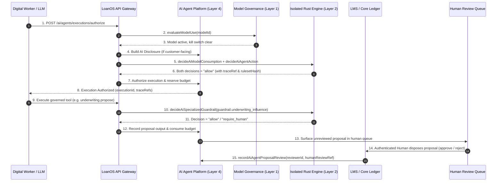

# LoanOS Agentic System — End-to-End Architecture, Decision Engine Integration, and Regulatory Compliance Specification

> Authoritative Architecture Specification  
> Repository Scope: `@loanos/core/ai`, `apps/api/src/routes/ai-agent-platform.js`, `apps/api/src/rules-engine.js`, `rules/fixtures/guardrail-*.json`, `rules/crates/rules-eval`  
> Regulatory Anchors: RBI Digital Lending Directions 2025 (RBI-DL-2025), RBI IT Governance Directions (RBI-IT-23), Digital Personal Data Protection Act 2023 (DPDP-2023), FREE-AI Framework 2025.

---

## Executive Summary

LoanOS implements a multi-tenant, compliance-first **Agentic AI System** for Regulated Entities (REs) in India (Banks, NBFCs, and HFCs). The system is built around a non-negotiable architectural invariant:

> **Digital workers propose; isolated deterministic engines and authenticated humans dispose.**

An AI agent in LoanOS possesses zero decision-making authority over credit limits, interest rates, disbursement approvals, borrower collections dispatch, or security settings. Model outputs enter domain workflows exclusively as provenance-tagged facts evaluated by an isolated, deterministic Rust decision engine (`rules/`) or as reviewable proposals in human operational queues.

This specification details the 7-layer architecture, core system interactions, regulatory compliance mapping, fail-closed security controls, and verification guarantees.

---

## 1. System Architecture & 7-Layer Structure

```
                  ┌─────────────────────────────────────────────────────────────┐
                  │                 GTM & CS AGENT RUNBOOKS                     │
     LAYER 7      │   Lead Research · Outreach · Qualification · Onboarding      │
                  └──────────────────────────────┬──────────────────────────────┘
                                                 │
                  ┌──────────────────────────────▼──────────────────────────────┐
                  │             AGENT SKILL EXECUTION CONTRACT                  │
     LAYER 6      │  SKILL_ROUTING_TABLE · SKILL_PERMISSION_MANIFESTS          │
                  └──────────────────────────────┬──────────────────────────────┘
                                                 │
                  ┌──────────────────────────────▼──────────────────────────────┐
                  │                 AGENT STUDIO GOVERNANCE                     │
     LAYER 5      │  11-Point Admission · Adverse Rehearsals · Knowledge Packs   │
                  └──────────────────────────────┬──────────────────────────────┘
                                                 │
                  ┌──────────────────────────────▼──────────────────────────────┐
                  │          AGENT PLATFORM & COMMERCIAL LIFECYCLE              │
     LAYER 4      │  Marketplace (11) · 4-Role Auth · Auto-Disclosure · Paise   │
                  └──────────────────────────────┬──────────────────────────────┘
                                                 │
                  ┌──────────────────────────────▼──────────────────────────────┐
                  │           DIGITAL WORKER RUNTIME & TOOL REGISTRY            │
     LAYER 3      │  Lease Fencing · Region Lock (ap-south-1) · 4 Governed Tools │
                  └──────────────────────────────┬──────────────────────────────┘
                                                 │
                  ┌──────────────────────────────▼──────────────────────────────┐
                  │            RUST DECISION ENGINE GUARDRAILS                  │
     LAYER 2      │  8 Guardrails · Fail-Closed · Tighten-Only · Severity Fold  │
                  └──────────────────────────────┬──────────────────────────────┘
                                                 │
                  ┌──────────────────────────────▼──────────────────────────────┐
                  │          MODEL GOVERNANCE & SEALING KERNEL                  │
     LAYER 1      │  Single-Source Hashing · Global/Model Kill Switches · UUIDs   │
                  └─────────────────────────────────────────────────────────────┘
```

### 1.1 Layer 1 — Sealing Kernel & Model Governance
- **Module**: `packages/core/src/ai/record-seal.js`, `model-governance.js`, `ai-interaction.js`
- **Sealing Kernel (`record-seal.js`)**: Single source of truth for canonical JSON encoding (`canonicalJson`), content hashing (`contentHash`), SHA-256 validation (`isSha256Hex`), and record sealing (`sealRecord`). Guarantees key-order independence and tamper detection across all governed records.
- **Model Inventory & Lifecycle (`model-governance.js`)**: Manages model state transitions through 7 stages (`draft` → `validation` → `approved` → `active` → `suspended` → `retired`). Enforces independent validation (`validator !== owner`) and high-risk evidence verification (disparate impact 0.8–1.25, SHAP/LIME explainability, red-team results).
- **Kill Switch**: Dual-level emergency kill switch (global and per-model). Automatically tripped by drift observations breaching tolerance thresholds. Clearance requires a documented `postIncidentReview` reference and independent approval.
- **Customer Interaction (`ai-interaction.js`)**: Generates mandated customer disclosures (`buildAiDisclosure`) and manages human handoff escalation queues (`requestHumanHandoff`, `resolveHumanHandoff`).

### 1.2 Layer 2 — Decision Engine Guardrail Family (Rust)
- **Crates**: `rules/crates/rules-eval`, `rules/crates/rules-service`, `rules/fixtures/`
- **Engine Isolation**: Evaluated within pure-Rust isolated engine instances per tenant (ADR 0003, ADR 0005). Evaluation executes without clock, RNG, or I/O access (INV-1, INV-8).
- **8 Standard Guardrails**:
  1. `guardrail.agent_action`: RBI-IT-23 / RBI-DL-2025 — Proposal-only, tenant match, India region, customer disclosure, no human-control authoring.
  2. `guardrail.data_access`: DPDP-2023 / RBI-IT-23 — Tenant boundary, approved purpose, consent evidence, minimum data fields only.
  3. `guardrail.collections_contact`: RBI-DL-2025 — 08:00–19:00 IST window, daily contact cap (3), weekly review cap (7), hardship flag, open grievance block.
  4. `guardrail.outbound_communication`: RBI-DL-2025 / DPDP-2023 — Channel approval, recipient consent, AI disclosure, proposal-only, human approval before dispatch.
  5. `guardrail.underwriting_influence`: RBI-DL-2025 / MODEL-HUMAN-OVERSIGHT — Proposal-only, no decision authority, human reviewer recorded for eligibility influence.
  6. `guardrail.case_mutation`: RBI-DL-2025 / RBI-IT-23 — Case in scope, approved workflow action, proposal-only, no direct writes, human approval.
  7. `guardrail.eligibility`: RBI-DL-2025 — Platform regulatory FOIR ceiling (0.65) enforced regardless of tenant policy override.
  8. `guardrail.model_consumption`: Core Engine — Evaluates global and model-scoped kill switches at query time.

### 1.3 Layer 3 — Digital Worker Runtime & Tool Registry
- **Modules**: `packages/core/src/ai/digital-worker-runtime-jobs.js`, `digital-worker-provider.js`, `digital-worker-tool-registry.js`
- **Durable Runtime Jobs (`digital-worker-runtime-jobs.js`)**: State machine (`queued` → `leased` → `completed` / `retry_wait` → `dead_letter`). Uses monotonic fencing tokens, configurable lease timeouts (1s–300s), exponential backoff, and four-eyes replay (`proposedBy !== approvedBy`).
- **Provider Boundary (`digital-worker-provider.js`)**: Constrains LLM SDK invocations (e.g. Amazon Bedrock). Enforces `ap-south-1` region locking, pinned model versions, constrained JSON schema validation, and proposal-only output.
- **Governed Tool Registry (`digital-worker-tool-registry.js`)**: 4 governed tools mapped to specialized guardrails:
  - `knowledge.retrieve` → `guardrail.data_access` (Direct worker allowed)
  - `communication.dispatch` → `guardrail.outbound_communication` (Direct worker DENIED; human domain API required)
  - `underwriting.propose` → `guardrail.underwriting_influence` (Proposal-only)
  - `case.change.propose` → `guardrail.case_mutation` (Proposal-only)

### 1.4 Layer 4 — Agent Platform & Commercial Lifecycle
- **Module**: `packages/core/src/ai/ai-agent-platform.js`
- **11 Banking Templates**: CAM preparation, underwriting review, loan fulfilment, borrower support, KYC document review, servicing review, collections preparation, complaints triage, fraud referral, field operations, regulatory reporting.
- **4-Role Human Activation (FST-034)**: Activation requires distinct human principals for `model_owner`, `model_validator`, `human_reviewer`, and `model_risk_manager` plus isolated control-engine approval.
- **Execution Authorization**: Auto-wires `buildAiDisclosure` for customer-facing executions when omitted. Evaluates model consumption and action guardrails via isolated engine gateway.
- **Commercial Metering & Invoicing**: Exact BigInt integer-paise calculations. Per-1k token rates calculated via ceil-division (`(units + 999n) / 1000n`). GST split into CGST (9%), SGST (9%), IGST (18%).

### 1.5 Layer 5 — Agent Studio Governance
- **Module**: `packages/core/src/ai/agent-studio-governance.js`
- **Knowledge & Memory**: Governed knowledge packs with SHA-256 content hashes and expiry dates. Automatic containment (`containExpiredAgentKnowledge`) auto-suspends dependent installations on pack expiry. Memory stores require privacy references (consent, legal hold, deletion proof).
- **Adverse Rehearsals**: Rehearsal outcomes (`runAgentTestSuite`) are computed server-side by the governed harness from configuration state; browser clients cannot supply pass/fail claims.
- **11-Point Production Admission**: Validates installation status, published version, 4 approvals, workflow validity, provider evidence, knowledge currency, memory store, budget, and model usability in a single gate.

### 1.6 Layer 6 — Agent Skill Execution Contract
- **Module**: `packages/core/src/ai/agent-skill-execution-contract.js`
- **Deterministic Skill Routing**: `SKILL_ROUTING_TABLE` maps task types (`fix_bug`, `start_feature`, `record_adr`, `change_lending_policy`, `aws_showcase_change`, etc.) to exact required skill chains. Keyword resolution is deterministic and fails closed (`refer`) on ambiguous input.
- **Path Permission Manifests**: `SKILL_PERMISSION_MANIFESTS` defines allowed write-path prefixes and required CI gates for all 13 repository skills. `validateSkillPermissions()` rejects changes outside declared paths.
- **Sealed Execution Evidence**: `recordSkillExecution()` produces SHA-256 content-hashed evidence records for completed skill runs.

### 1.7 Layer 7 — Governed GTM & Customer Success Runbooks
- **Locations**: `docs/gtm/ai-agents/`, `docs/gtm/customer-success/ai-agents/`
- **8 Runbooks**: Lead research, outreach personalization, content generation, opportunity qualification, website content, onboarding orchestration, health monitor, QBR prep.
- **Claims & Evidence Rules**: Mandatory shared context (`shared-context.md`), `Built` vs `Partial`/`Roadmap` claim labeling, cite-proof requirement, human-in-the-loop for external dispatch.

---

## 2. Core System Interactions & Data Flows



### 2.1 Interaction with Core Banking Systems

1. **Loan Origination System (LOS)**:
   - Agent outputs (e.g. `credit.cam` proposals) are ingested as unapproved draft attachments.
   - Sanction terms, credit limits, and FOIR calculations are evaluated by `rules-eval` using deterministic decimal math. The agent proposal carries no weight in decision engine evaluation.

2. **Loan Management System (LMS)**:
   - Servicing and repayment assistance agents (`servicing.request_review`, `collections.preparation`) generate work items in LMS staff queues.
   - Direct account mutations (restructuring, fee waivers, loan account closure) are denied to digital workers by `guardrail.case_mutation` and `guardrail.collections_contact`.

3. **Core Ledger & Audit Hash Chain (`packages/core/src/shared/audit.js`)**:
   - Every agent platform state transition appends an event to the tenant-scoped audit hash chain.
   - Audit events contain `resourceId`, `recordHash`, `actor`, and timestamp. The chain genesis is bound to the tenant's genesis block, ensuring cryptographic tamper evidence.

---

## 3. Regulatory Compliance Mapping

| Regulatory Framework | Mandatory Control | LoanOS Implementation Architecture |
|---|---|---|
| **RBI Digital Lending Directions 2025 (RBI-DL-2025)** | No autonomous lending decision authority | Templates carry `decisionAuthority: "none"`. Guardrails enforce `proposal_only` outcome. |
| **RBI Digital Lending Directions 2025 (RBI-DL-2025)** | Mandated collections contact window (08:00–19:00 IST) | `guardrail.collections_contact` checks IST hour, daily contact cap (3), and open grievance blocks. |
| **RBI IT Governance Directions 2023 (RBI-IT-23)** | Cross-tenant data isolation & boundary protection | Pure-Rust engine per tenant (ADR 0003), Postgres RLS per tenant, `tenant_match` required in all guardrails. |
| **Digital Personal Data Protection Act 2023 (DPDP-2023)** | Data minimization, consent verification, and purpose limitation | `guardrail.data_access` enforces minimum fields, consent presence, and sensitive data human approval. |
| **FREE-AI Framework 2025** | Mandated customer AI disclosure & human handoff option | `ai-interaction.js` generates disclosure statements. Customer-facing executions auto-wire disclosure references. |
| **Model Risk & Governance Standards** | Four-eyes activation, independent validation, emergency kill switch | FST-034 four-human role approval. `model-governance.js` global and per-model kill switch with PIR requirement. |

---

## 4. Technical Invariants & Verification Evidence

### 4.1 Load-Bearing System Invariants

- **INV-1 / INV-8 (Determinism & Lineage)**: Rust engine decisions read no clock or RNG. Given the same request facts and bundle hash, evaluation is byte-identical and replayable.
- **INV-4 (Guardrail Override)**: Platform regulatory guardrails execute alongside tenant logic. Breaching decisions are overridden with `GUARDRAIL_OVERRIDE` audit reasons. Unevaluable guardrails fail closed (`Refer`). `RequireHuman` never loosens a restrictive outcome.
- **INV-5 (Fail-Closed Default)**: Any error, missing required binding, engine timeout, or parse failure evaluates to a synthetic denial (`deny` / `refer`), never a permissive fallback.
- **INV-6 (Exact Money Math)**: Engine uses `rust_decimal` exclusively (f32/f64 prohibited by clippy gate). Domain JS code uses BigInt integer-paise calculations.
- **INV-10 (Audience Filtering)**: Presentation filtering strips internal reasons for borrower-facing callers while retaining complete reason sets in append-only audit logs.
- **DEC-4 (Provenance Tagging)**: Facts sourced from AI models must carry provenance tags (`source: "model"`, `model_id`, `model_version`). Untagged model facts fail closed.
- **FST-034 (4-Role Human Activation)**: Activation requires distinct human principals for `model_owner`, `model_validator`, `human_reviewer`, and `model_risk_manager`. Proposer cannot approve.

### 4.2 Automated Verification Results

```text
================================================================================
                        LOANOS VERIFICATION SUMMARY
================================================================================
Node.js Unit Tests         : 831 / 831 Passed (0 failures)
Rust Decision Engine Tests : 73 / 73 Passed (0 failures)
Documentation Integrity    : 136 / 136 Markdown files reachable (0 errors)
Capability Evidence Policy : 465 / 465 Capabilities linked & verified (0 errors)
Knowledge Graph Resolution : 465 Capabilities, 43 Engine IDs, 10 ADRs, 103 Claims (0 errors)
Documentation Currency     : 11 Rules checked (0 advisories)
Technical Academy Render   : 132 Pages rendered cleanly (`npm run technical-academy:build`)
================================================================================
```

---

## 5. Summary Matrix of AI Capabilities & Controls

| Layer | Primary Module | Core Functionality | Primary Regulatory Anchor | Verification Test Suite |
|---|---|---|---|---|
| **Layer 1** | `record-seal.js`, `model-governance.js`, `ai-interaction.js` | Single-source hashing, UUID governance IDs, model lifecycle, global/model kill switches, customer disclosure, human handoff | FREE-AI-2025, RBI-IT-23 | `tests/ai-agent-platform.test.js`, `rules/crates/rules-service/tests/ai_control.rs` |
| **Layer 2** | `rules/fixtures/guardrail-*.json`, `rules-eval` | 8 Rust guardrail decision models (data access, comms, underwriting, case mutation, collections, eligibility, model consumption) | RBI-DL-2025, DPDP-2023, RBI-IT-23 | `rules/crates/rules-eval/tests/guardrails_shadow.rs`, `rules/crates/rules-service/tests/ai_control.rs` |
| **Layer 3** | `digital-worker-runtime-jobs.js`, `digital-worker-provider.js`, `digital-worker-tool-registry.js` | Durable job queue with lease fencing, `ap-south-1` region lock, pinned model schema validation, 4 governed tool types | RBI-IT-23, DPDP-2023 | `tests/digital-worker-runtime-jobs.test.js`, `tests/digital-worker-provider.test.js`, `tests/digital-worker-tool-registry.test.js` |
| **Layer 4** | `ai-agent-platform.js`, `apps/api/src/routes/ai-agent-platform.js` | 11 banking templates, FST-034 4-human role activation, execution auth with auto-disclosure, BigInt paise pricing, GST invoice split | RBI-DL-2025, GST Regulations | `tests/ai-agent-platform.test.js`, `tests/ai-agent-operation-authority.test.js` |
| **Layer 5** | `agent-studio-governance.js` | Knowledge pack containment, privacy memory stores, server-derived adverse rehearsals, 11-point production admission check | RBI-IT-23, DPDP-2023 | `tests/agent-studio-governance.test.js`, `tests/agent-rehearsal-and-review.test.js` |
| **Layer 6** | `agent-skill-execution-contract.js` | Deterministic skill routing (`SKILL_ROUTING_TABLE`), path permission manifests, readiness checks, sealed execution evidence | Knowledge-to-Execution Stack Layer 4 | `tests/agent-skill-execution-contract.test.js` |
| **Layer 7** | `docs/gtm/ai-agents/`, `docs/gtm/customer-success/ai-agents/` | 8 governed runbooks for GTM and CS with mandatory load order, claim discipline, and cite-proof rules | GTM Claim & Evidence Policy | `npm run knowledge:check` |
