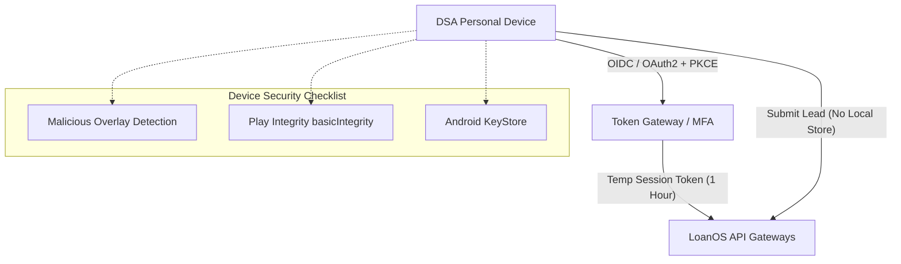

# Android DSA & Lead Origination App Architecture

## 1. Purpose and Persona

This document defines the architecture and design guidelines for the **LoanOS Android DSA & Lead Origination App**. 

Unlike the Field Operations App (which is for staff doing collections and physical KYC on managed corporate devices), this app targets **Direct Selling Agents (DSAs), freelance connectors, and retail partner dealers** who onboarding borrowers in the field using **unmanaged, personal mobile devices**.

The app is focused solely on:
* **Lead Capture & Verification:** Basic lead intake, deduplication check triggers, and consent logging.
* **Journey Tracking:** Real-time visibility into application pipeline stages for the agent's referred loans.
* **Integration Boundary:** Directly interfaces with the customer experience origination gateway (`/channels/leads`) and the borrower self-service onboarding journey.

---

## 2. Core Constraints: Zero-Local-Data Policy

Because DSAs operate on personal devices outside the enterprise MDM (Mobile Device Management) control boundary, the application enforces a strict **Zero-Local-Data** policy to remain compliant with RBI Digital Lending Directions:

1. **No Local SQLite Database:** No Room or SQLCipher database is maintained on the device for customer records. All customer data entered in forms is kept in-memory and cleared immediately upon submission or screen lock.
2. **Transit-Only Lifecycle:** Customer PII (e.g., Aadhaar, PAN, contact numbers) is strictly write-only on the client. Once a form page is completed and submitted, the client-side memory is garbage collected, and the UI transitions to a version-controlled token state.
3. **No Offline Support:** Due to compliance and data exposure risks, the DSA App **prohibits offline mode**. If connection is lost, data entry blocks, and no local cache is saved.

---

## 3. Threat Model and Security Control Plane

### 3.1 Authentication & Session Hygiene
* **Federated OIDC:** Agents authenticate using OIDC (OpenID Connect) with PKCE (Proof Key for Code Exchange) via their corporate Identity Provider (IdP). Implemented as: `LoginScreen` generates an S256 PKCE pair, calls `POST /auth/federated/start` with `tenantId`/`policyId`/`redirectUri`/`codeChallenge`, and opens the returned `authorizationUrl` in a Custom Tab. The IdP redirects to `com.loanos.dsaops://callback` (registered as a `BROWSABLE` intent filter on `MainActivity`, `launchMode="singleTask"`), which exchanges `code`+`codeVerifier` via `POST /auth/federated/exchange`.
* **MFA Enforced:** Multi-Factor Authentication (biometric or OTP) is required on every login by the IdP itself, outside the app's control.
* **Short-Lived Tokens:** Access tokens are strictly limited to **one hour**. No long-lived offline refresh tokens are stored. The backend resolves sessions from the `Cookie` header only (`sessionTokenFromRequest`), so the session credential is a cookie, not a bearer token — it is persisted via a Keystore-backed `PersistentCookieJar` (`EncryptedSharedPreferences`), not sent as `Authorization: Bearer`. Non-secret session metadata (tenantId, userId, partnerId derived from `channelScope.partnerIds`, expiresAt) is tracked separately in `SessionManager` and never holds the credential itself.

### 3.2 Runtime Device Posture Checks
At startup and periodically during use, the app performs lightweight runtime checks:
* **Overlay Detection:** Rejects execution if any overlay windows (which could capture touch events or details) are active.
* **Developer Options / Root Check:** Basic SafetyNet/Play Integrity evaluation (`basicIntegrity` check is required; `strongIntegrity` is preferred but relaxed compared to the Field Operations App to support a wider array of personal devices).
* **Biometric Prompts:** Sensitive actions (e.g., triggering consent OTP dispatch to the borrower) require a quick fingerprint/face authentication from the agent to verify they are still the active user.

---

## 4. Origination API Sequence & Entitlement Scoping

Every DSA is provisioned with a specific partner scope (`channelScope.mode === "partner"` on their `tenant_user` record). The backend restricts what data is readable:

1. **Lead Intake:** The agent posts to `POST /channels/leads`. The backend's `createChannelLead` requires more than the original "basic lead details" concept — `programmeId`, `requestedProductPolicyId`, `postalCode`, `contact` (name + mobile/email), `requestedAmountPaise`, `attribution`, `consentRef`, `disclosureRef`, and (for the `dsa` channel) `conductAttestationRef`. `LeadFormScreen` fetches eligible programmes/products from `/channels/operations` at runtime rather than hardcoding them, and requires the agent to confirm a code-of-conduct attestation checkbox before submit.
2. **Deduplication Check:** The backend checks contacts without revealing existing customer records to the agent (preventing phishing). If a contact exists, the lead enters `duplicate_review` status internally.
3. **Referred Portfolio View:** The doc originally specified a dedicated `GET /channels/leads?partnerId={id}` endpoint; **the backend does not implement it.** `PortfolioScreen` instead consumes `GET /channels/operations`, which is already partner-scoped server-side via the authenticated session's `channelScope` and includes `channelLeads`. The screen only ever renders name, product, and pipeline stage client-side — never contact details, bank account numbers, tax documents, or underwriting audit logs — even though the current payload technically carries contact fields; a dedicated pre-redacted projection endpoint remains a backend follow-up.
4. **Zero-Touch Consent:** Because there is no backend callback that returns a `consentRef`/`disclosureRef` once the borrower completes the Consent QR flow on their own device, the agent-facing app currently synthesizes those reference strings client-side (`consent:{partnerId}:{timestamp}`) rather than receiving a server-issued reference. This is a placeholder pending a real consent-completion callback API.

---

## 5. UI/UX and Localized Templates

To align with LoanOS's accessibility guidelines:
* **Preferred Language Resolution:** Key Fact Statements (KFS) or disclosures shown to the borrower on the agent's screen are dynamically fetched and resolved in the target Indian language via `resolveLocalizedTemplate()`.
* **Zero-Touch Screens:** If a signature or direct consent is required from the borrower, the app generates a localized QR code or sends a secure link via SMS/WhatsApp so the borrower does the interaction on **their own device**, preventing the agent from intercepting borrower inputs.
