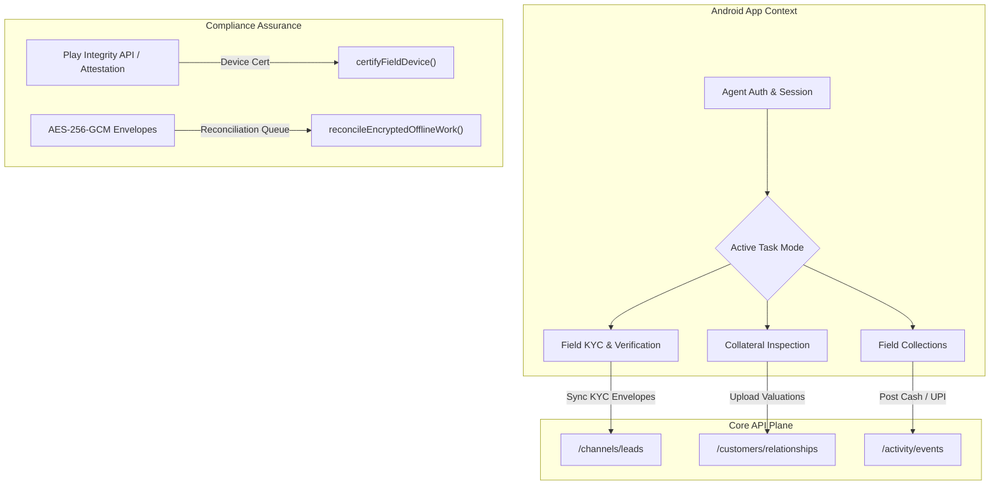

# Android Field Operations App Architecture & Design

## 1. Purpose and Scope

This document establishes the architecture and design guidelines for the **LoanOS Android Field Operations App**. 
Unlike customer-facing apps, this app is designed specifically for **tenant staff, field agents, and third-party partners** who perform off-grid or face-to-face lending operations. 

It provides support for three critical capabilities defined in the [Tenant Role Staffing & Feature Gating Map](tenant-role-staffing-and-feature-gating.md):
1. **Field Collections & Cash Posting** (`FST-013`): Handled by `collections_maker` and verified by `collections_checker` / `reconciliation_checker`.
2. **Borrower KYC/AML Onboarding** (`FST-004`): Handled by `kyc_officer` and checked by `kyc_checker`.
3. **Collateral/Security Inspection** (`FST-016`): Handled by `collateral_maker` and checked by `collateral_checker`.

This design aligns with the digital lending guidelines of the Reserve Bank of India (RBI) 2025/2026, which mandate strict controls over customer data storage, hardware-backed device safety, and audit traceability.

---

## 2. Key Personas and Capability Matrix



| Cap ID | Capability Name | Primary Role | Downstream Verification | Compliance Requirement |
| :--- | :--- | :--- | :--- | :--- |
| **FST-004** | Borrower KYC/AML Onboarding | `kyc_officer` | `kyc_checker` / `principal_officer` | Live photo, Aadhaar e-KYC/offline XML, and signed consent. |
| **FST-013** | Cash/Field Collection Posting | `collections_maker` | `collections_checker` / `reconciliation_checker` | Geo-tagged entry, unique receipt ID, printer attestation, exact paise math. |
| **FST-016** | Collateral/Security Inspection | `collateral_maker` | `collateral_checker` | Hardware-stamped asset images, geo-tagged valuation report. |

### 2.1 App Launch Sequence
Every launch progresses through four gates before any borrower data is reachable: **Login** (`POST /auth/login`, tenant/email/password/MFA — the resulting session is a cookie, not a bearer token, since the backend's `sessionTokenFromRequest` only reads the `Cookie` header) → **Biometric Gate** (`BiometricPrompt`, re-proves presence on every launch, independent of the server session) → **Device Certification Check** (§3.1 — blocks until a security_admin has certified this device) → **Dashboard** (Field KYC / Collections / Collateral / Sync Queue tabs).

---

## 3. Compliance and Security Architecture

The app runs on field-certified devices. By default, it operates under a strict **Zero Trust** security model.

### 3.1 Device Certification (`certifyFieldDevice`)
A device cannot connect to the backend or download field allocations unless it has been certified. The certification process verifies:
* **Hardware-backed Attestation:** The app uses Google Play Integrity API to generate hardware attestation tokens verifying that the OS has not been compromised (no root, bootloader locked, valid signature).
* **System Settings Enforcement:** The app checks that screen lock (PIN/Biometrics) is active, file system encryption is enabled, and USB debugging/developer options are disabled.
* **Independent Approval:** A device's certification signature must be verified by `certifyFieldDevice()` on the backend, requiring independent review by a security administrator (four-eyes principle) — `certifyFieldDevice()` rejects any submission where `testedBy === approvedBy`. **The app itself never calls this endpoint.** A field device cannot legitimately certify itself, so `DeviceCertificationScreen` only polls the read-only `GET /experience/devices/{deviceId}/status` endpoint after login, displaying the device's stable ID (`Settings.Secure.ANDROID_ID`) for the security administrator to certify from the tenant back office, and re-checks every 15 seconds until certified.

```javascript
// Verification anchor in packages/core/src/operations/customer-experience-completion.js
if (input.encryptedStorage !== true || input.screenLockEnforced !== true || input.remoteWipeEnabled !== true) {
  fail("device_certification_blocked", "Encrypted storage, screen lock, and remote wipe are mandatory.");
}
```

### 3.2 On-Device Data Storage
Under RBI guidelines, storing unencrypted Customer PII (Personally Identifiable Information) on local storage is strictly prohibited.
* **Encrypted Database:** The app uses **SQLCipher** to encrypt the SQLite/Room database.
* **Cryptographic Key Management:** The SQLCipher passphrase is a random 256-bit value generated once per install and stored only in `EncryptedSharedPreferences`, whose master key lives in the Android Keystore System (hardware-backed TEE/StrongBox where available). It is never derived from anything guessable and never leaves the device.
* **Data Sanitization:** When an agent logs out or a session expires, `KeyManager.wipeLocalData()` deletes both the passphrase and the encrypted database file, rendering all local data permanently unrecoverable.

### 3.3 Per-Envelope Key Leasing (`leaseEncryptionKey`)
Rather than a hardcoded key baked into the APK, each offline envelope is encrypted with a fresh, short-lived AES-256 data key fetched from `POST /experience/keys/lease` immediately before use.
* **Certified-device gated:** The lease endpoint enforces the same certification check as `enqueueEncryptedOfflineWork` — an uncertified or expired device is rejected.
* **Issued once, retained never:** The server generates the key, returns the raw material to the device exactly once, and persists only `keyId`/`deviceId`/`expiresAt` for audit — never the key bytes. A compromised device therefore only ever exposes recently-leased keys, not a long-lived shared secret.
* **Scope:** This is a demo-scale in-process issuer, not a production KMS/HSM integration; production deployment should back this endpoint with a real key-management service.

---

## 4. Offline Work Queue and Sync Architecture

Field agents often operate in areas with poor internet connectivity. The app uses a secure, versioned, offline-first sync mechanism that prevents data leaks.

```
+-----------------------------------+
|      Android SQLite Database      |
|  (Encrypted with SQLCipher Key)   |
+-----------------+-----------------+
                  |
                  | User Action (e.g., Collection Posting)
                  v
+-----------------+-----------------+
|      Generate AES-256-GCM       |
|    Local Key & Encrypt Payload    |
+-----------------+-----------------+
                  |
                  | Wrap into Envelope
                  v
+-----------------+-----------------+
|      Offline Queue Envelope      |
|  (Contains only ciphertext/hash)  |
+-----------------+-----------------+
                  |
                  | Network Restored (Sync Queue)
                  v
+-----------------+-----------------+
|         LoanOS Core API           |
|  (enqueueEncryptedOfflineWork)    |
+-----------------------------------+
```

### 4.1 Plaintext-Free Enveloping (`enqueueEncryptedOfflineWork`)
When the app is offline, any transaction (e.g., collection posting, lead onboarding) is encrypted locally before being written to the outbox queue.
* **AES-256-GCM Envelope:** The payload is encrypted with a per-envelope leased key (§3.3). Only the ciphertext, salt, initialization vector (nonce), authentication tag, and cryptographic hash are queued.
* **No Plaintext Leaks:** Plaintext fields containing customer data (e.g., name, mobile, financial info) are never written to standard outbound queues or logs.
* **App-side responsibility ends at enqueue:** `SyncManager` calls `POST /experience/offline-work/enqueue` only. `POST /experience/offline-work/reconcile` is a back-office `reconciliation_checker` action (§4.2) — the field device never calls it.

### 4.2 Conflict Detection and Reconciliation
When connectivity is restored, the queued envelopes are pushed to the backend queue via enqueue; a `reconciliation_checker` later reconciles them:
* **Idempotency Verification:** Every envelope contains an `idempotencyKey` that prevents replay attacks. If the app retries an enqueue the server already holds (e.g. a partially-acknowledged sync), it responds `409` and the app marks the envelope `uploaded` rather than resubmitting.
* **Version Validation:** The backend checks the `baseVersion` of the record (e.g., the loan account version when the agent left the office) against the server's `currentVersion`.
* **Conflict Resolution:** If the version has changed (e.g., the customer paid online while the agent was in the field), the envelope is flagged as `conflict` (`aggregate_version_changed`) and routed to the `reconciliation_checker` for manual resolution.

---

## 5. UI and UX Core Guidelines

To support field operations under varying conditions, the app interface must follow these standards:

1. **Branded and Localized UI:**
   * Dynamic branding is resolved at startup based on the active tenant configuration.
   * All templates, forms, and Key Fact Statements (KFS) are rendered in the borrower's preferred Indian language (supporting `"as", "bn", "gu", "hi", "kn", "ml", "mr", "or", "pa", "ta", "te", "ur"`).
   * Fallback logic is handled securely via the backend's `resolveLocalizedTemplate()`.
2. **Accessibility-First Design:**
   * High-contrast mode support for field usage in direct sunlight.
   * Full keyboard/screen-reader navigation.
   * Large, clear tap targets to prevent entry errors in high-stress collection environments.
3. **Outage Indicators:**
   * An explicit visual indicator of the app's online/offline sync status.
   * Clear warnings to the agent showing the number of pending unsynced offline envelopes.
