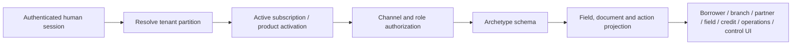

# Archetype journey workspaces

## Decision and status

LoanOS now renders the 21 canonical lending journeys through **21 governed product schemas generated from one reusable schema system**. The earlier 11 shared schemas were removed because they concealed mandatory product facts. Archetypes remain layout and component-reuse metadata only; they are not product definitions.

This document is the architecture, design and operations record for JD-03. The implemented slice covers schema definition, tenant entitlement, channel/role projection, multilingual accessible rendering, server-persistent drafts, exact schema lineage, privacy-safe audit, and the common UI shell. It does **not** claim composed application-to-closure completion or production readiness. JD-04, JD-05 and JD-06 remain.

## Coverage

| Workspace archetype | Canonical journeys | Specialist capture |
| --- | --- | --- |
| `term_lending` | personal loan, MSME term loan, professional practice loan | employment/business type, exact-paise income and obligations, bank statements, cash-flow verification |
| `property_secured` | home loan, loan against property, secured business loan | property/type, title review, valuation, construction stage, title chain, stage certification |
| `asset_finance` | personal/commercial vehicle, equipment/machinery, green equipment | supplier/dealer, invoice, serial/chassis/VIN, margin, inspection and delivery |
| `gold_custody` | gold loan | packet, weight, purity, assay, vault/custody and controlled release |
| `revolving_working_capital` | MSME working capital | limit, drawing power, stock statement and receivables ageing |
| `co_lending` | co-lending programme | arrangement, lender shares, escrow, agreement and allocation |
| `trade_receivables` | invoice discounting, purchase-order finance, supply-chain finance, trade-finance workflow | anchor/buyer, trade asset, face value, due date, acceptance, draw |
| `seasonal_field` | agriculture and allied finance | crop/activity, season, acreage, land/tenancy and geotagged field evidence |
| `group_field` | microfinance group lending | group/centre, member sequence, household assessment and group attestation |
| `merchant_pos` | consumer durable finance | merchant, SKU, invoice, down payment, delivery confirmation |
| `priority_term` | education loan | institution, course, admission, fee schedule, cost and moratorium |

The machine-enforced product authority is `PRODUCT_JOURNEY_CONTRACTS`; `PRODUCT_TO_WORKSPACE_ARCHETYPE` selects reusable layout components. Catalogue validation requires exactly 21 contract-bound product schemas. Adding a product without a schema, omitting a contract fact/evidence item, copying untranslated labels, or duplicating a field identifier fails validation.

## Channel model

Schemas are projected for seven operating channels:

| Channel | Principal boundary | Typical authority |
| --- | --- | --- |
| borrower | authenticated borrower session | own application capture and submission |
| branch | tenant human | tenant admin, branch operator or operator |
| partner | tenant human | authorised partner/channel roles; tenant admin can preview and operate |
| field | tenant human | field officer/supervisor; tenant admin can preview and operate |
| credit | tenant human | credit maker/checker/manager; tenant admin can preview and operate |
| operations | tenant human | operations maker/checker/operator; tenant admin can preview and operate |
| control | tenant human | tenant/security/compliance/audit authority |

Tenant service keys, platform break-glass identities and AI/workload identities cannot use an interactive workspace. An AI agent must act through its separate guarded action contract and may not impersonate a human channel. Borrowers cannot switch to staff channels. Staff cannot project a borrower channel.

## Schema contract

Every schema contains:

- stable `schemaId`, positive `schemaVersion` and canonical SHA-256 checksum;
- mapped journey types and supported languages;
- ordered sections and stable field IDs;
- field type, required state, permitted channels, data class and response-exposure policy;
- required document metadata and channel boundaries;
- authorised actions, role requirements, actor attribution and maker-checker flags;
- browser persistence, business-data caching, offline and audit-payload policies.

Money values cross the workspace API as non-negative integer paise strings. Decimal quantities such as acreage, weight and purity use non-negative decimal strings. The service rejects floating-point money, unknown fields, invalid dates, negative integers and submission with missing visible mandatory fields.

English and Hindi labels are built in. Tenant-managed language packs remain a governed extension; translation approval, semantic equivalence and accessibility regression evidence are required before activation.

## Entitlement and projection

Entitlement is fail closed. A journey appears only when the same tenant has an effective active product subscription, an active governed product journey, an active specialist configuration, or an active canonical product policy. Expired, suspended, other-tenant and unknown products do not appear. This is intentionally greenfield; there is no legacy default-all fallback.

Channel projection happens on the server. The browser never receives disallowed fields, documents or actions. Role-bound actions appear only when the authenticated session has a required role. Tenant and actor IDs are always taken from the authenticated request context, never from the body.

## Draft lifecycle and data model

`journeyWorkspaceDrafts` is tenant-partitioned persistent state. Each record binds:

- tenant, authenticated actor and channel;
- canonical journey type and derived archetype;
- exact schema ID, version and checksum;
- exact validated values and idempotency key;
- content checksum, status and timestamps.

Draft status is `draft` or `submitted` in this slice. Terminal submitted records cannot be rewritten. Identical idempotent retries return the original record; identity conflicts fail without revealing whether another actor owns the draft. API projections mask financial, personal and restricted values. The persistent tenant partition may hold raw captured values and therefore must use the existing tenant encryption/key boundary in production.

The audit event records resource ID, actor, journey/channel, schema lineage and content checksum. It never records captured values. The global authenticated-request activity chain separately records route, session and authentication source without request bodies or query strings.

## API

| Method and path | Result |
| --- | --- |
| `GET /journey-workspaces/{channel}/catalogue` | entitled journey catalogue projected to the authenticated channel |
| `GET /journey-workspaces/{channel}/schemas/{journeyType}` | exact field/document/action schema for one entitled journey |
| `GET /journey-workspaces/{channel}/drafts` | authenticated actor's own same-channel drafts |
| `POST /journey-workspaces/{channel}/drafts/{journeyType}` | validate and persist a draft or submitted capture |

Static consumers are mounted at `/t/{tenant}/portal/journeys/`, `/staff/journeys/`, `/partners/journeys/` and `/field/journeys/`. Staff can select branch, credit, operations or control mode, subject to server authorization.

Guide & Academy decision: JD-03 uses schema-derived field help, evidence labels, privacy status and authorised-action labels inside the workspace because the exact instructions vary by product, channel and schema version. JD-04 now supplies an administration/API composition boundary without adding a new interactive screen, so the existing “Trace the first compliant loan” overview remains current. A released staff lifecycle timeline, approval, pause/recovery or escalation screen must add role-specific canonical guidance and refresh its verification date.

## Privacy, security, offline and accessibility

- No local storage, session storage, IndexedDB or service worker stores lending data.
- All business requests use `cache: no-store`. Offline mode exposes only the already loaded shell/schema and disables mutations.
- The UI renders untrusted labels and values with DOM `textContent`; it does not use HTML injection sinks.
- Sensitive fields use `autocomplete=off`; server responses mask or omit classified values.
- Semantic sections, explicit labels, a skip link, live status regions, keyboard focus movement, responsive layout and reduced-motion support form the accessibility baseline.
- UI actions emit controlled screen-activity identifiers only. They never copy form values into activity evidence.
- CSP, SRI, managed WAF/device controls, formal WCAG audit and approved multi-language content remain deployment acceptance obligations.

## Failure and recovery operations

| Failure | Required behavior |
| --- | --- |
| no active product entitlement | return 403; do not reveal schema or draft existence |
| wrong principal/channel/role | return 403 and retain authenticated access evidence |
| schema mismatch or unknown field | reject before persistence |
| provider or network offline | disable mutation; never queue browser-held PII |
| duplicate retry | return the checksum-identical record; conflict on changed content |
| actor/tenant mismatch | indistinguishable 404-style draft failure; no cross-actor detail |
| product suspension or expiry | remove it from subsequent catalogue projections; in-flight lifecycle pause is composed in JD-04 |
| access revocation | central session revocation blocks the next request immediately; JD-02 pauses assigned specialist work and JD-04 pauses/invalidates assigned composed work |
| corrupted/tampered lineage | checksum validation blocks downstream reliance; incident and evidence-custody procedures apply |

Operators investigate with authenticated activity evidence and the tenant audit chain, not browser logs or captured request bodies. A schema update is additive only through a new version/checksum; existing drafts retain their original lineage and require an explicit governed migration or restart policy.

## Test and acceptance evidence

- `tests/journey-workspace.test.js`: 21 product-schema coverage, contract checksums, typed bilingual facts/evidence, same-archetype distinction, entitlement, channel/role denial, redaction, ownership, idempotency, required fields and exact money.
- `tests/journey-workspace-api.test.js`: authenticated API, role/channel boundary, service-key denial, persistence, static mount and audit-value exclusion.
- `tests/journey-workspace-ui.test.js`: accessibility hooks, multilingual rendering, safe DOM construction and browser/offline privacy constraints.

JD-03 is complete at the schema/workspace slice when these tests and the product-depth audit pass. JD-04 now consumes this boundary. Production rollout still requires JD-05 generated full-stack adverse journeys, JD-06 selected provider/operations evidence, tenant UAT and independent accessibility/security/privacy acceptance.
