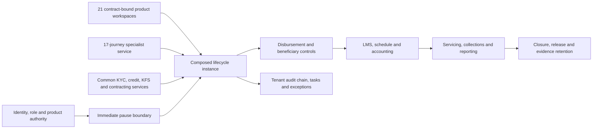
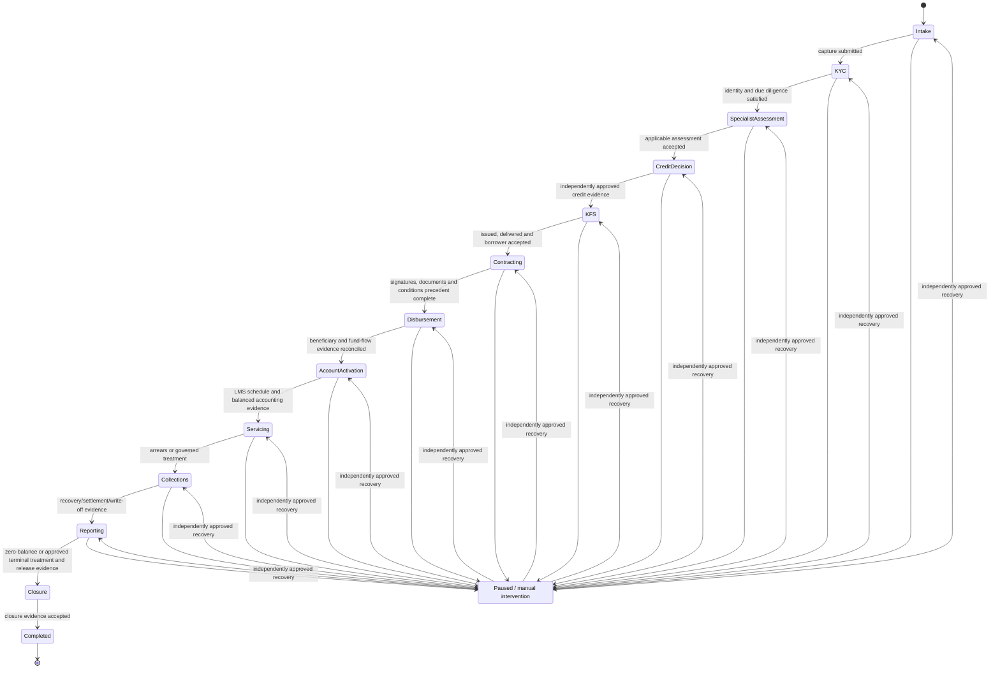

# Composed product-journey lifecycle

## Decision, scope and truthful status

LoanOS uses one tenant-persistent, version-bound lifecycle instance to compose the common lending controls with the 11 workspace archetypes and all 21 canonical product journeys. A product-specific assessment is a guarded stage inside this lifecycle; it is never an alternative route around KYC, credit authority, KFS, contracting, disbursement, LMS, accounting, servicing, reporting or closure.

This document is the architecture, design, security and operations record for JD-04. The implemented boundary is a lifecycle orchestration control plane: it records stage evidence, transition proposals and independent approvals, binds every case to exact product/schema/policy/workflow/accounting versions, blocks stale or incomplete transitions, exposes pauses and manual intervention, and persists an attributable history through an authenticated tenant API. It composes existing services by controlled evidence references; it does not pretend that every downstream provider or every existing domain API is one distributed transaction.

The following claims remain deliberately out of scope:

- JD-01: complete self-service product subscription, add-product, staffing and rollback administration;
- JD-05: generated full-stack, browser and PostgreSQL execution of every mandatory scenario for every current template version;
- JD-06: selected commercial providers, institution UAT, production operations, security, capacity and DR evidence; and
- production readiness: zero of the 21 journeys is production-ready from repository evidence alone.

### Guide and Academy decision

JD-04 adds an authenticated administration/API composition boundary, not a new interactive staff or borrower screen. It therefore does not add a separate Guide and Academy article in this batch. The existing “Trace the first compliant loan” learning path remains the user-facing overview, while this document is the operating contract for API and platform operators. Before a lifecycle timeline, transition approval, pause/recovery task or escalation is exposed in a staff/borrower UI, that workflow is incomplete until the canonical `/help/` guidance, recovery instructions and verification date are updated with the released screen behavior.

## Architectural position

The lifecycle is a process manager, not a replacement for the decision engine or domain systems:

- the Rust business decision engine decides against versioned policy and returns replayable lineage;
- the isolated control rules engine decides identity, staffing and separation-of-duties authority;
- workspace schemas govern capture and channel projection;
- specialist kernels produce archetype-specific assessment evidence;
- LOS/LMS/accounting/collections modules remain the systems of record for their domain objects; and
- the lifecycle proves which exact evidence allowed a stage to move and where recovery is required.

## Coverage: 21 products over 11 workspace archetypes

| Workspace archetype | Canonical product journeys | Composition emphasis |
| --- | --- | --- |
| `term_lending` | `personal_loan`, `msme_term_loan`, `professional_practice_loan` | income/cash-flow assessment, term schedule, affordability and standard contracting |
| `property_secured` | `secured_business_loan`, `loan_against_property`, `home_loan` | title/valuation, charge creation, staged disbursement and collateral release |
| `asset_finance` | `equipment_machinery_finance`, `green_equipment_finance`, `personal_vehicle_loan`, `commercial_vehicle_finance` | asset/supplier evidence, margin, inspection, hypothecation and delivery |
| `gold_custody` | `gold_loan` | assay, packet seal, dual-control custody, vault movement and controlled release |
| `revolving_working_capital` | `msme_working_capital` | sanctioned limit, drawing power, periodic review and revolving ledger |
| `co_lending` | `co_lending_programme` | arrangement/version, lender allocation, escrow, participant accounting and reconciliation |
| `trade_receivables` | `invoice_discounting`, `purchase_order_finance`, `supply_chain_finance`, `trade_finance_workflow` | party/asset validation, draw/settlement, anchor/buyer evidence and receivable reconciliation |
| `seasonal_field` | `agriculture_allied_finance` | crop/activity cycle, field evidence, seasonal schedule and priority-sector reporting |
| `group_field` | `microfinance_group_lending` | member/group identity, household assessment, group attestation and field collections |
| `merchant_pos` | `consumer_durable_finance` | merchant/SKU/invoice, down payment, delivery confirmation and merchant settlement |
| `priority_term` | `education_loan` | institution/admission/fee schedule, moratorium, tranche conditions and co-borrower evidence |

The workspace presentation mapping combines `unsecured_term` and `business_term` as `term_lending`; their product, policy and risk lineage remains distinct. The lifecycle never infers accounting, collateral, reporting or provider behavior solely from the presentation archetype. Those bindings come from the exact active product configuration.

## Lifecycle state machine

The lifecycle keeps one current stage and an append-only transition history. The machine stages are `application_capture`, `kyc_aml`, `specialist_assessment`, `credit_decision`, `kfs_acceptance`, `contracting`, `disbursement`, `lms_accounting`, `servicing`, `collections`, `regulatory_reporting`, `closure` and terminal target `completed`. Overlay statuses are `active`, `paused`, `manual_intervention` and `completed`. This first composition boundary does not implement arbitrary decline or cancellation transitions; an adverse outcome is recorded as a failure/manual-intervention condition and cannot satisfy the next stage's affirmative evidence.

The diagram uses readable labels for the exact machine stages above; recovery restores only the exact recorded `resumeStage`. There is no free-form “set status” mutation and no transition that skips an intermediate gate. In this first kernel, transitions advance monotonically through the stage sequence: collections cure/return-to-servicing and dedicated terminal decline/cancellation paths remain later governed contract additions rather than implicit jumps.

## Stage and evidence contract

Every evidence item has a stable ID/type, same-tenant resource reference, content checksum, producer, produced-at timestamp, policy/provider lineage where applicable and verification state. A reference without its required lineage does not satisfy a gate. Evidence is attached through a governed mutation and becomes part of the transition checksum.

| Stage | Mandatory common evidence before exit | Archetype/product additions | Downstream invariant |
| --- | --- | --- | --- |
| Intake/capture | entitled active product, submitted workspace draft/schema checksum, borrower or business subject, consent/purpose and channel attribution | archetype facts/documents declared by the exact workspace schema | no unknown/expired product or stale schema enters KYC |
| KYC and due diligence | identity result, KYC/CKYC path, AML/sanctions/PEP disposition, fraud/device referral resolution and required consent | business/entity/beneficial-owner, group/member or field evidence when applicable | unresolved or unavailable mandatory checks fail closed |
| Specialist assessment | exact specialist configuration/case/result for the 17 specialist journeys, or explicit common-assessment evidence for the remaining four | collateral, custody, trade asset, co-lending, field/group, merchant or revolving controls | `refer` and open specialist exceptions require manual intervention; they are not approvals |
| Credit decision | decision-engine request/result/trace, policy and bundle hashes, affordability and credit facts, maker recommendation | product/archetype risk conditions and model provenance | decision outcome and authority are replayable; stale policy/version blocks |
| Approval | independently approved proposal, approved terms, conditions and validity window | sanction/committee/partner approval requirements | maker cannot check own proposal; approval cannot change approved checksum |
| KFS | generated KFS checksum/version, APR/charges/repayment terms, language, delivery and authenticated borrower acceptance | product-specific facility/tranche/co-lending disclosures | accepted KFS terms bind contracting and disbursement; client-supplied pricing is not trusted |
| Contracting | document packet checksum, signatures/eSign/eStamp result, vault reference, conditions precedent and collateral/security perfection where required | multiparty, supplier/dealer, institution, group, partner or custody signatures | failed, expired or incomplete signatures/conditions block fund flow |
| Disbursement | beneficiary/account verification, approved tranche, direct fund-flow instruction, provider result/callback and reconciliation evidence | stage, supplier, merchant, institution, escrow or lender-allocation controls | timeout/ambiguous callback never creates an assumed success; duplicate uses idempotent replay |
| LMS/accounting activation | loan/facility account reference, exact schedule/limit, accounting profile, balanced opening journal and linkage to disbursement | revolving drawing power, co-lender allocations, trade draw, moratorium/seasonal schedule | lifecycle cannot enter servicing until account and accounting evidence agree |
| Servicing | postings/accruals, payment allocation, borrower communications and governed change history | limit/stock review, collateral monitoring, custody, tranche/follow-up or partner obligations | product changes are new governed events; historical approved terms are immutable |
| Collections/recovery | DPD/classification, approved strategy, contact/field evidence, payment/settlement/waiver/write-off authority | group/field, collateral enforcement, gold auction or partner allocation evidence | no harassment, unauthorized waiver or unapproved balance change; agent actions remain guarded |
| Reporting | applicable CIC/CKYC/FIU/CERSAI/CRILC/PSL and internal/partner reporting outputs, acceptance/reconciliation or not-applicable policy evidence | archetype-specific regulatory and partner obligations | a silent “not applicable” does not satisfy the gate; policy/evidence is required |
| Closure/release | zero-balance or approved terminal accounting treatment, reconciled ledger, NOC, collateral/custody/security release, reporting closure and retention reference | asset/title/gold release, charge satisfaction, partner/trade settlement | closure is irreversible through normal workflow; correction uses a governed compensating process |

## Version and lineage model

A lifecycle instance permanently binds the following creation-time lineage:

- tenant and canonical journey type;
- active product-journey ID/version/checksum and product template ID/version/checksum;
- workspace archetype, schema ID/version/checksum and source draft/reference;
- specialist configuration/case/version/checksum when the journey is specialist-backed;
- lending policy, workflow and accounting profile references/versions;
- regulated entity, channel and subject references; and
- creator identity, authentication/session attribution, timestamps and initial content checksum.

Later evidence adds its own version lineage; it never mutates the creation binding. If product, schema, specialist configuration, policy, workflow or accounting versions change while a case is in progress, the case remains pinned. A governed migration must compare the old and new contract, disclose material term changes, acquire any required borrower acceptance, produce an independent approval and append a migration/compensation record. Automatic “latest version” rebinding is forbidden.

Every proposed transition binds:

1. instance ID and current version;
2. exact current stage and proposed next stage;
3. sorted evidence IDs and checksums;
4. policy/decision/authority references;
5. maker identity, purpose and idempotency key; and
6. a canonical SHA-256 content checksum.

Approval is valid only for that checksum. Concurrent or delayed approval against a changed instance is stale and fails closed. Successful execution increments the instance version and records before/after stage, transition/action IDs, maker, checker, evidence, decision lineage and timestamp.

## Authority, maker-checker and first-class agents

Business transitions are two-step mutations: a currently authorized maker proposes an immutable action and a different currently authorized checker approves and executes it. The API derives tenant, actor, principal type, roles and authentication source from the session; body-supplied authority is ignored or rejected.

Control requirements:

- product/stage role requirements are data from the governed product/workflow configuration;
- the control rules engine evaluates staffing, separation-of-duties and action authority independently from lending rules;
- maker and checker must be distinct active principals and must both retain authority at execution time;
- a user cannot satisfy both roles through two sessions, role aliases or delegated impersonation;
- service keys cannot perform human workflow transitions;
- workload/AI principals cannot use interactive routes or self-approve;
- a fixed or dynamic AI agent may propose only through a sponsored workload identity, with a current human sponsor, model-consumption decision and `guardrail.*` action result;
- any `require_human`, stale kill-switch state, inactive model, missing sponsor or revoked workload authority blocks execution; and
- break-glass authority cannot silently waive a business gate. It can contain/pause work and must create incident, review and expiry evidence.

Some operational events are safety actions rather than ordinary business transitions. Product/configuration suspension, fraud containment or access revocation may pause immediately without waiting for the affected maker. Resumption or bypass is never automatic and requires independent recovery approval.

## Pause, revocation and work containment

An instance pauses immediately when any of the following becomes true:

- product journey or specialist configuration is suspended/retired/expired;
- assigned or pending-action principal is suspended, inactive or loses a required role;
- sponsored workload identity, sponsor or model authority is revoked;
- material KYC/fraud/sanctions/collateral/provider/reconciliation exception opens;
- bound lineage fails checksum/version validation;
- downstream state becomes ambiguous after timeout or callback conflict; or
- operator invokes a governed safety hold with evidence.

Pause records cause code, triggering resource/principal, evidence reference, actor/system source, prior stage as `resumeStage`, timestamp and affected pending action IDs. The lifecycle projects a critical task/escalation; pending approvals remain visible but cannot execute. The next request also re-evaluates current authority, so persistence of an old session or request cannot revive access.

Recovery requires all blockers to be resolved, work to be reassigned where authority was lost, evidence to be refreshed if stale, and a new independently approved resume proposal. Resumption returns only to `resumeStage`; it cannot skip a gate. If safe forward progress is impossible, cancellation/decline/closure uses an explicitly permitted terminal path with compensation and reporting evidence.

## Compensation and manual intervention

The lifecycle does not attempt a cross-service rollback. Financial, provider and legal effects are append-only and are corrected through explicit compensating actions.

| Failure point | Containment | Compensation/recovery |
| --- | --- | --- |
| draft/capture persisted but lifecycle creation fails | no lifecycle transition; retain source checksum | idempotently retry creation or cancel source draft; do not duplicate subject/application |
| specialist assessment `refer` or kernel error | open manual intervention and pause | resolve exact exception, reassign, refresh evidence and repropose; never coerce `refer` to approval |
| decision/provider timeout | stage remains unchanged and outcome is unknown | query by idempotency key/provider reference, reconcile callback, then record one verified result |
| stale proposal/version | reject approval without side effect | discard/supersede and create a fresh proposal against the current version |
| KFS delivery/acceptance mismatch | block contracting | reissue a new governed version and obtain authenticated acceptance; retain superseded version |
| signature/condition failure | block disbursement | correct packet/condition under new evidence and approvals; never alter the signed checksum |
| payment timeout or duplicate callback | pause as ambiguous, no assumed success | reconcile provider/bank/beneficiary state; either confirm the original idempotent payment or create an approved reversal/retry |
| disbursement succeeded but LMS/accounting activation failed | critical manual intervention; no additional tranche | reconcile source payment, create account/journals idempotently, or post approved reversal/refund; preserve financial audit trail |
| unbalanced/reconciliation mismatch | block servicing progression/close | post independently approved correction or suspense resolution; rerun reconciliation and certification |
| access revoked mid-work | pause affected instance and pending action | reassign to authorized principal, invalidate stale approval, independently resume |
| closure/release partially fails | retain `reporting`/manual state; do not declare closed | finish NOC/release/charge satisfaction and reporting acknowledgement, or open an exception with owner/SLA |

Manual intervention is a governed work queue with reason, severity, owner/required role, evidence, SLA, status and resolution approval. It is not a generic free-text override. Resolution can refresh evidence, compensate an effect, reassign work, resume the same stage or move through an explicitly allowed terminal transition.

## Persistent model and API boundary

The lifecycle service persists tenant-qualified `composedJourneyLifecycles`, immutable `composedJourneyTransitionRequests` and `composedJourneyEscalations` in the existing tenant data document. Evidence manifests and transition history remain checksum-bound inside those records; manual-intervention state is projected through the lifecycle and escalation rather than hidden in a transient error. The file store provides local/restart behavior; PostgreSQL relies on the existing tenant RLS and advisory-lock boundary. No record key is globally addressable without tenant qualification.

The authenticated route surface provides:

| Operation | Behavior |
| --- | --- |
| `GET /admin/composed-journeys` | return the same-tenant portfolio, transition requests, escalations and controlled projections |
| `POST /admin/composed-journeys/instances` | bind an entitled product, exact schema/source draft and applicable specialist configuration/case |
| `POST /admin/composed-journeys/instances/{instanceId}/transitions` | create an immutable checksummed request containing the next stage's evidence set |
| `POST /admin/composed-journeys/transitions/{transitionId}/approval` | re-evaluate authority, separation of duties, evidence and current version, then move exactly one edge |
| `POST /admin/composed-journeys/instances/{instanceId}/failures` | persist a fail-closed manual-intervention condition and critical escalation |
| `POST /admin/composed-journeys/instances/{instanceId}/pause` | immediately freeze mutation and expose a controlled escalation |
| `POST /admin/composed-journeys/instances/{instanceId}/resume` | create a checksummed recovery proposal with blocker-resolution evidence; a distinct checker must execute it through the standard transition-approval endpoint before the recorded stage is restored |

Exact method/path names are defined by `apps/api/src/routes/composed-journeys.js`. The route admits tenant-human users only. Read authority is limited to tenant admin, operator, credit manager, security admin and auditor; mutations exclude auditor and approvals additionally exclude operator. All mutations use authenticated tenant locking, actor-bound audit events and content idempotency. A request body cannot select another tenant, principal, stage contract, product archetype or accounting profile. Reads do not disclose whether an identifier exists in another tenant.

## Security and privacy threat model

| Threat | Control and required evidence |
| --- | --- |
| cross-tenant object reference | tenant context from authentication, tenant-qualified keys, PostgreSQL RLS and indistinguishable not-found behavior |
| body-supplied actor/tenant/role | server overwrites authority from authenticated context; interactive human route rejects service/workload principals |
| product/archetype bypass | product must be canonical, active and entitled; schema/product mapping and specialist applicability are derived server-side |
| direct stage jump | allow-listed state graph plus mandatory stage evidence; no generic status setter |
| self-approval/collusion | independent current principals, control-engine SoD decision, immutable proposal checksum and role revalidation at execution |
| stale approval/replay | expected instance version/stage, content checksum and exact-content idempotency; changed replay conflicts |
| fabricated evidence reference | same-tenant resource/type/checksum/producer validation; provider signature/callback verification remains JD-06 where commercial adapters are absent |
| money precision corruption | exact integer-paise or decimal-string contracts at domain boundaries; no binary-float transition facts |
| provider ambiguity/double disbursement | idempotency, callback authenticity, unknown-result pause, beneficiary/payment reconciliation before LMS activation |
| access revoked mid-action | immediate pause, session/token revocation, pending-action containment, role re-evaluation and reassignment before resume |
| agent impersonation or unsafe automation | sponsored workload identity, isolated guardrail decision, model kill switch, human-checker boundary and full action attribution |
| PII leakage through audit/tasks | evidence references, classifications and checksums only; no captured field values or document bodies in audit/task projections |
| history tampering | append-only lifecycle history plus tenant audit hash chain and checksum-bound evidence/action lineage |
| silent exception loss | persistent manual-intervention record, critical task/escalation, owner/SLA and explicit approved resolution |
| false production claim | machine depth audit keeps production-ready at zero and retains JD-01/JD-05/JD-06 until their evidence exists |

## Operations model

### Queues and ownership

- intake/KYC exceptions route to customer-identity or compliance operations;
- specialist referrals route to the product/archetype credit queue;
- approval/KFS/contracting blockers route to credit/operations with maker-checker staffing checks;
- payment/LMS/accounting ambiguity routes to disbursement, payments and finance reconciliation jointly;
- servicing/collections events route by DPD, vulnerability and product strategy;
- reporting/closure exceptions route to regulatory operations, finance and collateral/custody owners; and
- access/product suspension creates a critical platform-control escalation plus business owner task.

Every queue item carries tenant, lifecycle ID, stage, reason code, severity, required role, owner, SLA, evidence/transition references and last safe stage. It does not carry raw application facts.

### Metrics and alerts

Operators should monitor at least:

- lifecycle count/age by product, archetype, stage and tenant;
- transition proposal/approval latency and self-approval/stale-version denial counts;
- paused/manual-intervention count, age, cause, owner and breached SLA;
- KYC/specialist/decision/KFS/contract/disbursement gate failure rate;
- ambiguous provider results, duplicate callbacks and unreconciled payments;
- disbursed-but-not-account-activated count and age (critical, expected zero);
- unbalanced accounting/reconciliation/reporting exceptions;
- access/product/configuration revocation containment latency;
- collections-to-cure/settlement/closure movement and vulnerable-borrower controls; and
- audit append/checksum failures (critical security incident).

Metrics use tenant-safe identifiers and controlled reason codes, never PII, raw policy, document content or borrower-entered values.

### Runbooks

1. **Authority revoked:** revoke session/token, pause affected lifecycles, invalidate pending actions, create critical escalation, reassign, refresh control decision, independently approve resume.
2. **Provider result unknown:** stop downstream movement, query by original idempotency/provider reference, verify signed callback, reconcile bank/provider records, record one outcome, then compensate or continue.
3. **Disbursement/LMS split:** freeze further tranche/payment work, confirm fund flow, idempotently create missing account/posting or approve reversal, balance/reconcile, certify, then resume.
4. **Policy/schema/configuration changed:** keep case pinned, assess materiality, choose complete-on-old/cancel/migrate, obtain approvals and borrower redisclosure if required, append migration evidence.
5. **Audit/evidence integrity failure:** fail closed, preserve immutable source artifacts, open security incident, identify affected tenant/version range, restore from verified backup or replay, independently attest before resume.
6. **Closure failure:** do not mark closed, assign NOC/release/reporting owners, reconcile balance and provider/registry state, satisfy each missing evidence type, then submit a fresh closure transition.

## Backup, recovery and replay

- Lifecycle instances, proposals, evidence metadata and audit events are restored as one tenant-consistent recovery set.
- Recovery validates checksums, current stage against history, instance version monotonicity and evidence references before accepting mutation traffic.
- Approved-but-not-executed proposals remain pending only if actor authority, expected version and evidence are still current; otherwise they are marked stale and must be reproposed.
- External side effects are never replayed blindly. Provider/payment/accounting operations reconcile by idempotency and source reference before retry.
- A reconstructed stage is derived from the last valid append-only transition, not from a client status field.
- DR proof, RPO/RTO, failover/failback and tenant-witnessed restore remain JD-06 production acceptance.

## Test strategy and evidence boundary

JD-04 automated evidence must prove:

- exact coverage of all 21 canonical journeys and their 11 workspace archetypes;
- legal transition graph and rejection of stage skipping, stale versions and changed idempotent replays;
- mandatory stage evidence before every transition, plus active exact specialist-configuration lineage for all 17 specialist-backed journeys;
- specialist assessment result/lineage/exception-disposition evidence before credit; JD-05 still must exercise real specialist case outcomes against each full-stack scenario;
- independent maker-checker with current role/authority checks;
- specialist-configuration suspension and principal/role/SCIM revocation causing immediate visible pause; JD-01 still owns the unified tenant product-subscription suspension workflow;
- reassign, evidence refresh, manual resolution and independently approved resume to the exact prior stage;
- ambiguous downstream/compensation paths, especially disbursement-to-LMS/accounting split;
- file-store restart persistence, authenticated tenant/actor API binding and cross-tenant denial, plus an environment-gated PostgreSQL/RLS persistence case; and
- evidence-only audit/task projections without borrower values.

This is a composed control-plane test boundary, not production certification. JD-05 still must generate full lifecycle executions for all mandatory happy/adverse/recovery scenarios across file and PostgreSQL drivers, authenticated APIs and browser workspaces. JD-06 still must prove selected-provider signatures/callbacks/reconciliation, commercial credentials and residency, migration, capacity, security, observability, support, backup/restore and failover/failback. Tenant UAT and regulated-entity acceptance remain mandatory.

## Change and deployment procedure

1. Amend the versioned stage/evidence/action contract and threat/control analysis.
2. Add or change policy/workflow data; do not scatter product-specific bypasses in route code.
3. Extend the golden lifecycle and adverse/recovery corpus for every affected archetype/product.
4. Independently approve the new contract and deploy it with an effective window.
5. New instances bind the new version; in-flight instances remain pinned unless governed migration is explicitly approved.
6. Canary by tenant/product, monitor blocked/paused/ambiguous work and verify audit/task projections.
7. On failure, stop new activation and use the documented compensation/migration path; never rewrite history or silently downgrade a case.

## Completion statement

JD-04 is complete only at the implemented composition boundary when the kernel, authenticated API, persistence/restart tests and this architecture record agree, the machine depth audit removes `JD-04` from all 21 journeys, and no journey is labeled production-ready. JD-01, JD-05 and JD-06 remain explicit for every journey.
