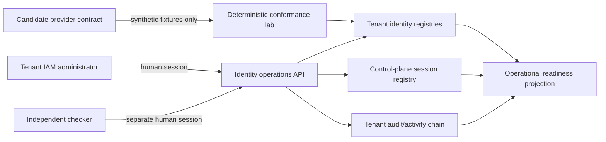

# Tenant identity operations and vendor-neutral conformance lab

Status: executable greenfield control slice, 15 July 2026. All connector execution described here is simulated unless a tenant-specific commercial activation record says otherwise. No such live activation exists today.

## Objective

This design closes the product-side operating gap between having federation/SCIM protocol code and being able to safely administer it for an Indian regulated entity. It supplies one tenant IAM control room, governed identity lifecycle actions, deterministic vendor-candidate tests, cross-system reconciliation, explicit session containment and a readiness projection. It does not make a vendor, cloud service, SIEM, WORM store, MDM system or control-engine fleet live.

## Architecture and trust boundaries

Tenant data holds federation rotations, recovery requests, conformance campaigns and directory reconciliations. Sessions remain control-plane records but carry exactly one tenant and principal. API callers cannot supply the effective actor: it is always derived from the authenticated tenant-user session. Service credentials may operate the scoped SCIM protocol, but cannot propose, approve, recover or certify human access.

The canonical IAM administration workspace is a read-only tenant projection at `GET /admin/identity-governance/workspace`. It composes ownership, effective principal access, pending role/staffing/ownership/emergency requests, escalation state, feature readiness and minimum launch coverage. Every mutation continues to use its existing maker-checker domain workflow; the workspace is not a privileged bypass.

## Lifecycle controls

### Planned federation metadata and key rotation

`POST /admin/identity-operations/federation/rotations/proposals` records the proposed metadata checksum, validity, signing-key set and overlap window. The overlap must be between one hour and fourteen days. A different administrator approves at `/federation/rotations/{requestId}/approval` with a change approval and simulator/provider conformance reference. Approval retains the previous metadata checksum and signing-key set for rollback evidence.

### Emergency suspension and session containment

`POST /admin/identity-operations/federation/policies/{policyId}/suspension` is intentionally immediate. It requires a reason and incident/evidence reference, suspends the policy and explicitly revokes every active session for affected federated users. `POST /admin/identity-operations/sessions/revoke` provides the same attributed, tenant-scoped all-session containment for one principal.

SCIM `active=false` now performs four actions in the same operation: inactivate the login, suspend the canonical principal, calculate staffing/pause/escalation impact, and mark every matching persisted session `revoked` with revoker and reason. The audit event includes the exact revoked session IDs. Rehire never silently restores old canonical grants.

`POST /federation/v1/logout-events` accepts a trusted-adapter attestation for a signed, short-lived OIDC back-channel logout, OIDC token-revocation, SAML single-logout or provider-session-revocation event from a tenant service credential scoped to `federation:revoke`. Issuer, audience, tenant, policy, subject, optional provider session id, validity window and evidence checksum are bound into an idempotent event checksum. A conflicting replay is rejected; an exact replay returns the original result. Matching persisted sessions are revoked immediately and the exact session IDs, revoker and reason are retained. This surface remains a simulator/proxy contract (`commerciallyLive: false`) until a tenant-specific provider and signature-validation adapter are commercially activated and witnessed.

### Authenticator recovery

Recovery is a two-human workflow. A proposer identifies the subject and records independent identity-verification evidence. The subject, proposer and approver cannot collapse into the same control. Approval clears the old MFA secret, marks `mfa_setup` as the required next action and immediately revokes all existing sessions. The subject must establish a new authenticator before normal access.

### Directory reconciliation

The reconciliation endpoint compares a provider snapshot with tenant-local federated users by external ID. It reports missing-local, missing-provider and active-status drift. Any provider-supplied role is reported as a forbidden role push and is never written to LoanOS grants. The input evidence reference, counts, findings and checksum are retained.

## Conformance lab

Six vendor-neutral packs are executable:

| Family | Required coverage |
| --- | --- |
| OIDC | success, signature/issuer/audience/tenant/nonce/PKCE/replay/stale evidence, JWKS rollover, provider outage |
| SAML gateway | success, signature/issuer/recipient/request/time/tenant/replay/stale evidence, key rollover, outage |
| SCIM | success, signature/tenant/replay/stale evidence, duplicate/out-of-order events, role escalation, deactivation, rehire, outage |
| Device posture | success, signature/tenant/replay/stale posture, unmanaged device, missing MFA, assurance downgrade, outage |
| Isolated control engine | success, mTLS/key/bundle/tenant/instance isolation, replay/staleness, kill switch and outage |
| SIEM/WORM custody | success, signature/tenant/replay/staleness, export gaps, checksum/retention/custody failures and outage |

A campaign is proposed by one human and approved by another. `POST /conformance/campaigns/{campaignId}/run` executes every required scenario and records checksummed evidence. The strongest possible result is `simulator_certified`; every campaign permanently carries `executionMode: simulated` and `commerciallyLive: false`. The API rejects attempts to create a live campaign. A commercial activation must later bind vendor credentials, legal/data-residency approval, provider-native fixtures, witnessed UAT and production monitoring through the separate vendor-activation controls.

## Tenant IAM control room

The dashboard Administration dialog now includes **Identity Operations**. It shows active users/sessions, federation state, open escalations and conformance coverage; performs immediate session containment; proposes/approves recovery; creates, approves and runs complete simulator campaigns; and reconciles a provider directory snapshot. The screen labels simulator evidence prominently so an operator cannot mistake it for a live integration.

The existing Tenant Users, Access Reviews, Service Access, Audit and canonical Identity Governance APIs remain authoritative for user records, access reviews, service credentials, role grants/revocations, staffing, emergency access and activity custody. The control room is an operational composition of those controls, not a second authorization model.

The same administration area now exposes the full canonical IAM workspace: effective human and agent access, the 85-role catalogue and hard SoD pairs, removal-impact checks, maker-checker grant/revocation queues, all 34 feature-staffing policies, pause/escalation state, ownership transfer and time-bounded emergency access. It also exposes the operational-run and resilience-drill controls described below. Tenant service credentials cannot read or operate this human administration workspace.

## Operational readiness automation

`GET /admin/identity-operations/summary` recomputes readiness from current users, sessions, federation policies, all six conformance families, role requests, recovery/rotation requests, staffing configuration and open escalations. It reports `ready_for_simulated_operations` or `needs_attention`, never production-ready or commercially-live. Production activation additionally requires:

1. contracted tenant-specific providers and approved India processing/storage/subprocessor positions;
2. provider-native positive and adverse fixtures plus witnessed conformance;
3. tested logout/token revocation, signing-key rollover and directory reconciliation with measured leaver p95/p99;
4. live MDM/device posture if required by tenant policy;
5. deployed per-tenant control-engine identity, mTLS and KMS grants;
6. connected SIEM/WORM/trusted-time services with restore and gap detection;
7. institutional IAM/SOC/on-call ownership, runbooks, evidence retention and independent assurance.

### Governed operational runs

`POST /admin/identity-operations/automation/runs` builds a checksum-sealed plan from metadata expiry, missing/stale conformance packs, overdue rotation/recovery/role requests, overdue access reviews, stale directory reconciliation, unsafe active sessions and uncustodied activity batches. Automation is deliberately narrow: it may automatically revoke an active session belonging to an inactive principal or inactive federation policy. It cannot approve a role or recovery, activate federation or close an escalation. Every run retains its findings, exact containment results, actor, evidence reference and plan checksum. `GET /automation/runs` returns the tenant run history.

This is an executable run-once control, not yet a deployed scheduler. A production scheduler must use a named workload identity, tenant fencing, lease/idempotency controls, alert delivery and externally retained run evidence.

### Witnessed resilience drills

The drill registry covers IdP outage, signing-key compromise, SCIM-credential compromise, leaver containment, control-engine outage, SIEM/WORM outage, metadata rollover and directory drift. One tenant/security administrator proposes a drill with a runbook and target detection, containment and recovery times; a different administrator witnesses it through `/admin/identity-operations/drills/{drillId}/witness`. Passing requires measured objectives, fail-closed observation, complete audit evidence and independent execution/recovery references. A failed drill remains failed evidence and must be followed by remediation and a new drill. Every drill is explicitly simulated and non-live.

## Enterprise and organisation-admission emulator coverage

The identity packs are complemented by two exhaustive simulator catalogues:

- 85 enterprise-platform scenarios across KMS/HSM/vault, broker/DLQ, CDC/checkpoints, MDM/device lifecycle, deployment compensation/rollback and trusted time;
- 153 organisation-admission scenarios across `INT-ADM-01` through `INT-ADM-10`, including invitation delivery, legal/tax and regulated-entity authority, representative signature, corporate domain, abuse/device risk, contracting, billing, infrastructure provisioning and workforce federation/re-verification.

Both catalogues are deterministic, checksum-bound, tenant-isolated and fail closed on missing, altered, duplicate or unsafe evidence. They certify LoanOS contracts only. They do not certify or activate a commercial provider.

## Rollback and recovery

- A failed planned rotation remains pending/blocked and leaves the active policy unchanged.
- A bad approved rotation uses retained previous metadata/key IDs under a new independently approved rotation; records are not edited in place.
- Emergency policy suspension is not automatically reversed. Re-certification and new login evidence are required.
- Session revocation is irreversible. A user signs in again only after the incident/recovery control permits it.
- Conformance results are campaign evidence. A failed or stale campaign is superseded by a new campaign, never relabelled live.
- Directory reconciliation only reports drift; it does not mass-create, reactivate, grant roles or delete users.

## Executable evidence

- `packages/core/src/identity-operations.js`
- `packages/core/src/identity-integration-conformance.js`
- `packages/core/src/identity-operational-automation.js`
- `packages/core/src/enterprise-platform-conformance.js`
- `packages/core/src/organisation-admission-conformance.js`
- `apps/api/src/routes/identity-operations.js`
- `apps/api/src/routes/enterprise-controls.js`
- `apps/dashboard/index.html` and `apps/dashboard/index.js`
- `tests/identity-operations.test.js`
- `tests/identity-integration-conformance.test.js`
- `tests/identity-operations-api.test.js`
- `tests/identity-operational-automation.test.js`
- `tests/federated-revocation-api.test.js`
- `tests/iam-administration-workspace.test.js`
- `tests/enterprise-platform-conformance.test.js`
- `tests/organisation-admission-conformance.test.js`
- `tests/scim-protocol-api.test.js`
