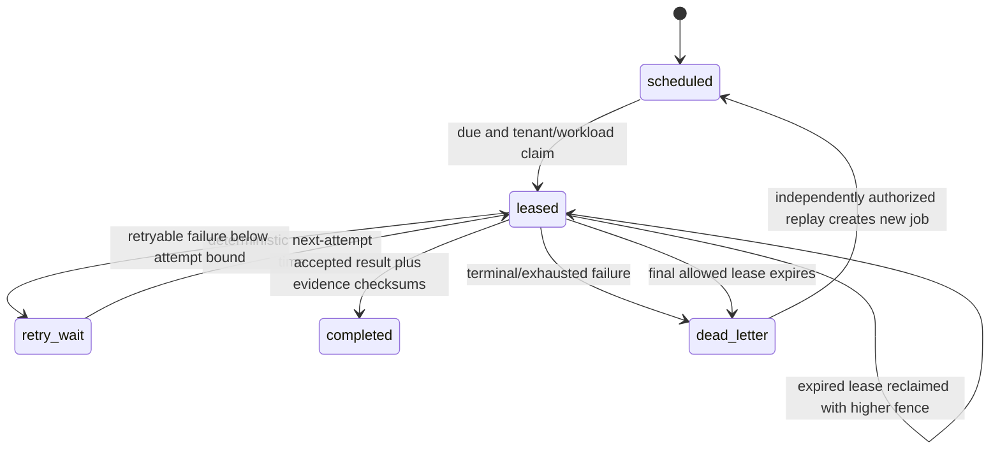

# Identity operations worker runtime

## Scope

This runtime makes four tenant identity-control checks durably schedulable without granting a worker governance authority. The persistent API adapter is now implemented; cloud scheduling and certified provider handlers remain deployment work.

| Job type | Intended handler |
| --- | --- |
| `identity_readiness_assessment` | Recalculate staffing, role, federation and control readiness. |
| `directory_reconciliation` | Compare the certified provider directory with the tenant principal registry. |
| `federation_metadata_validation` | Check issuer metadata, signing keys, certificates and expiry windows. |
| `activity_custody_verification` | Confirm activity evidence reached its configured immutable custody boundary. |

The core module is `packages/core/src/identity-operations-worker.js`. It is a deterministic state transition layer; it does not open network connections, hold provider secrets or assert that any commercial integration is live. A deployed scheduler and provider ports remain necessary for production operation.

## Persistent state contract

The owning store must durably and atomically persist these tenant-partitioned registries:

| State field | Purpose |
| --- | --- |
| `identityOperationsJobs` | Immutable job envelopes plus current attempt, lease and outcome. |
| `identityOperationsWorkerRuns` | Checksummed bounded worker-run records and summaries. |
| `identityOperationsDeadLetters` | Checksummed exhausted-job snapshots. |
| `identityOperationsJobReplays` | Independently authorized replay lineage. |
| `identityOperationsDeadLetterReplayRequests` | Checksum-sealed human replay proposals and independent approval state. |
| `identityOperationsAlerts` | Visible retry, lease-expiry and terminal-failure alerts. |
| `identityOperationsEscalations` | Critical human-action records for terminal failures. |

Every job is keyed by tenant and job ID. Its immutable envelope includes the job family, named workload-identity reference, purpose, idempotency key, payload and payload checksum, original schedule, retry bounds and envelope checksum. Payloads carry control-plane references rather than credentials. Workload identities are named URI references and must match exactly at claim and completion.

## State model

The original dead-lettered job never returns to a runnable state. Replay creates a new immutable job linked through `parentDeadLetterId`; the dead letter and replay authorization remain historical evidence.

## Safety invariants

1. Claims select only due jobs belonging to one tenant and one exact workload identity.
2. A monotonically increasing fence generation and checksum-derived fencing token invalidate resumed stale workers.
3. An expired lease cannot record an outcome. The final permitted lease expiry dead-letters instead of silently exceeding `maxAttempts`.
4. Successful work requires explicit acceptance, an evidence reference, evidence checksum and result checksum.
5. Failed work is restrictive: it becomes bounded retry or dead letter. It never becomes successful by default.
6. Backoff is deterministic exponential delay bounded by the configured maximum; no clock, randomness or provider I/O enters the core calculation beyond the caller-supplied transition time.
7. Every failed attempt emits an alert. Terminal failure also emits an escalation requiring authorized investigation.
8. Dead-letter replay requires distinct requester and authorizer identities, an authority reference, reason and an idempotency/checksum boundary.
9. A run cannot finalize while one of its claims lacks a durable outcome. Retry, dead letter or displacement by a higher fence marks the run `failed_closed`.
10. These workers may assess, reconcile, validate and verify. They do not approve roles, activate federation, close escalations or bypass the isolated control decision engine.

## Persistent API contract

Authenticated tenant administrators schedule jobs at `POST /admin/identity-operations/worker/jobs`. They name an active tenant service credential, not an arbitrary workload URI. The API derives `loanos-service://{tenant}/{credential}` and stores audit lineage. `GET /admin/identity-operations/worker` exposes jobs, runs, dead letters, replay requests, replays, alerts and escalations.

The service plane is `POST /identity-operations-worker/v1/claims`, `/jobs/{jobId}/outcome`, and `/runs/{runId}/finalize`. It requires `identity-operations:work` or `*`; tenant and workload identity are credential-derived. Dead letters use separate human proposal and approval routes so requester and authorizer cannot be body assertions from one session.

## Store and deployment obligations

The file-backed adapter and HTTP contract are executable. A production PostgreSQL adapter must implement compare-and-set or an equivalent transaction around claim, outcome and replay transitions; the pure object state used in tests is not a distributed lock. Database policies must enforce tenant partitioning independently of application filters. Scheduler workload identities require short-lived credentials, least-privilege access to the four named handler ports and separate audit attribution from human operators.

Operators must monitor open alerts, critical escalations, DLQ depth, oldest due job, lease expiry rate, retry exhaustion, run completion status and workload-identity authentication failures. Replaying a dead letter does not close its alert or escalation automatically; closure remains a governed human action with separate evidence.
