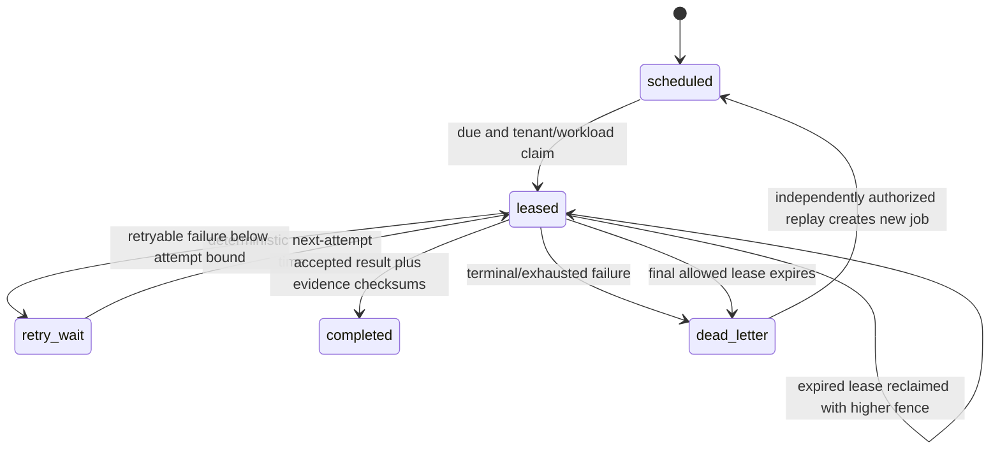

# Identity operations worker runtime

Operational procedures: [identity worker operations runbook](identity-worker-operations-runbook.md).

## Scope

This runtime makes four tenant identity-control checks durably schedulable and executable without granting a worker governance authority. The persistent API adapter, bounded runner, explicit simulator, health/readiness/Prometheus surface, container profile, and PostgreSQL atomic-claim test are implemented. Certified commercial-provider handlers and a managed scheduler deployment remain external work.

| Job type | Intended handler |
| --- | --- |
| `identity_readiness_assessment` | Recalculate staffing, role, federation and control readiness. |
| `directory_reconciliation` | Compare the certified provider directory with the tenant principal registry. |
| `federation_metadata_validation` | Check issuer metadata, signing keys, certificates and expiry windows. |
| `activity_custody_verification` | Confirm activity evidence reached its configured immutable custody boundary. |

`packages/core/src/identity-operations-worker.js` is the deterministic state transition layer. `packages/core/src/identity-operations-worker-runtime.js` is the bounded execution loop and service-plane client. `scripts/run-identity-operations-worker.mjs` is the runnable process. The transition layer does not open network connections or hold provider secrets; the runner authenticates only through a tenant-bound service credential and never accepts a tenant ID from a job payload.

## Persistent state contract

The owning store must durably and atomically persist these tenant-partitioned registries:

| State field | Purpose |
| --- | --- |
| `identityOperationsJobs` | Immutable job envelopes plus current attempt, lease and outcome. |
| `identityOperationsWorkerRuns` | Checksummed bounded worker-run records and summaries. |
| `identityOperationsDeadLetters` | Checksummed exhausted-job snapshots. |
| `identityOperationsJobReplays` | Independently authorized replay lineage. |
| `identityOperationsDeadLetterReplayRequests` | Checksum-sealed human replay proposals and independent approval state. |
| `identityOperationsAlerts` | Visible retry, lease-expiry and terminal-failure alerts. |
| `identityOperationsEscalations` | Critical human-action records for terminal failures. |

Every job is keyed by tenant and job ID. Its immutable envelope includes the job family, named workload-identity reference, purpose, idempotency key, payload and payload checksum, original schedule, retry bounds and envelope checksum. Payloads carry control-plane references rather than credentials. Workload identities are named URI references and must match exactly at claim and completion.

## State model



The original dead-lettered job never returns to a runnable state. Replay creates a new immutable job linked through `parentDeadLetterId`; the dead letter and replay authorization remain historical evidence.

## Safety invariants

1. Claims select only due jobs belonging to one tenant and one exact workload identity.
2. A monotonically increasing fence generation and checksum-derived fencing token invalidate resumed stale workers.
3. An expired lease cannot record an outcome. The final permitted lease expiry dead-letters instead of silently exceeding `maxAttempts`.
4. Successful work requires explicit acceptance, an evidence reference, evidence checksum and result checksum.
5. Failed work is restrictive: it becomes bounded retry or dead letter. It never becomes successful by default.
6. Backoff is deterministic exponential delay bounded by the configured maximum; no clock, randomness or provider I/O enters the core calculation beyond the caller-supplied transition time.
7. Every failed attempt emits an alert. Terminal failure also emits an escalation requiring authorized investigation.
8. Dead-letter replay requires distinct requester and authorizer identities, an authority reference, reason and an idempotency/checksum boundary.
9. A run cannot finalize while one of its claims lacks a durable outcome. Retry, dead letter or displacement by a higher fence marks the run `failed_closed`.
10. These workers may assess, reconcile, validate and verify. They do not approve roles, activate federation, close escalations or bypass the isolated control decision engine.

## Persistent API contract

Authenticated tenant administrators schedule jobs at `POST /admin/identity-operations/worker/jobs`. They name an active tenant service credential, not an arbitrary workload URI. The API derives `loanos-service://{tenant}/{credential}` and stores audit lineage. `GET /admin/identity-operations/worker` exposes jobs, runs, dead letters, replay requests, replays, alerts and escalations.

The service plane is `POST /identity-operations-worker/v1/claims`, `/jobs/{jobId}/outcome`, and `/runs/{runId}/finalize`. It requires `identity-operations:work` or `*`; tenant and workload identity are credential-derived. Dead letters use separate human proposal and approval routes so requester and authorizer cannot be body assertions from one session.

## Atomic persistence and tenant isolation

The worker does not maintain a second queue database. The API request wrapper opens one PostgreSQL transaction, takes `pg_advisory_xact_lock(hashtext(tenantId))`, switches tenant-data statements to the RLS-constrained `loanos_app` role, and commits claim/outcome/finalization plus audit event together. Competing claim requests for one tenant therefore serialize; different tenants retain independent lock keys. The file adapter provides an equivalent process-local load/modify/save mutex for development.

`tests/postgres-store.test.js` includes a live-database conformance test that schedules one tenant job and races two claim transactions. Exactly one may receive the lease, and the stored tenant partition must contain one corresponding claimed run. The test is an expected environment skip until `DATABASE_URL_TEST` points to a schema-initialized PostgreSQL instance; it is not evidence that an untested managed database is live.

If outcome persistence fails, the runner does not attempt finalization. The job remains leased and can only be recovered through lease expiry and a higher fencing generation. This deliberately prefers visible delayed work over an unrecorded side effect.

## Execution modes and provider boundary

The packaged runner has two conceptual modes:

| Mode | Behaviour | Production claim |
| --- | --- | --- |
| `simulated` | Validates the reference-only payload contract, exercises the full claim/outcome/finalization protocol, and emits `commerciallyLive: false` evidence. Secret-like payload fields are rejected. | Never proves a provider operation. In a production environment it starts only when `LOANOS_ALLOW_SIMULATED_IDENTITY_WORKER=true` is deliberately set. |
| `live` | Uses injected `assessIdentityReadiness`, `reconcileDirectory`, `validateFederationMetadata`, and `verifyActivityCustody` ports and accepts only explicit provider evidence. | The generic runner refuses this mode because no commercial adapter is bundled. A vendor deployment must inject certified ports. |

The simulator can close simulator-labelled jobs for conformance and operational testing; it cannot satisfy the unified tenant activation gate's live/commercial evidence dimensions.

## Runtime bounds and health

Each process is bounded by `maxJobsPerRun`, `leaseMs`, `jobTimeoutMs`, request timeout, and scheduler interval. Handlers run sequentially inside a claimed batch so the process cannot exceed the declared maximum concurrent provider work. Timeouts are retryable but remain subject to the job's stored attempt bound; missing handlers, invalid envelopes, checksum mismatch, secret-bearing payloads, or unverified responses fail closed.

The worker exposes:

- `GET /healthz`: process liveness;
- `GET /readyz`: false after shutdown or any unresolved run/persistence failure;
- `GET /metrics`: Prometheus counters/gauges for runs, claims, success, failure, timeout and persistence failure.

Operators must alert on readiness zero, failed-closed runs, outcome-persistence failures, DLQ growth, oldest due job, repeated lease expiry and service-credential authentication failure. The runner logs one JSON run summary per iteration and never logs the API key.

## Deployment and operation

Run the local worker directly:

```bash
LOANOS_API_URL=http://127.0.0.1:3040 \
LOANOS_IDENTITY_WORKER_API_KEY='<tenant service key>' \
LOANOS_IDENTITY_WORKER_EXECUTION_MODE=simulated \
node scripts/run-identity-operations-worker.mjs
```

The opt-in Compose profile is:

```bash
LOANOS_IDENTITY_WORKER_API_KEY='<tenant service key>' \
docker compose --profile identity-simulator up --build
```

The environment contract is in `deploy/identity-operations-worker.env.example`. Deploy one tenant-bound workload identity per credential/security boundary, inject the key from a secret manager, use India-resident execution, deny outbound destinations except the LoanOS API and approved provider endpoints, and terminate with SIGTERM so active work drains before the process exits.

## Remaining production obligations

The file and PostgreSQL paths, HTTP protocol and runnable scheduler are executable. Production still requires selected vendors, contracts, India-residency/subprocessor approval, short-lived workload credentials, certified provider-native schemas and error semantics, injected live ports, network allow-listing, managed deployment/auto-scaling, alert routing/on-call ownership, live telemetry/WORM custody, database test execution against the selected service, soak/chaos evidence, and institution-witnessed UAT.

Operators must monitor open alerts, critical escalations, DLQ depth, oldest due job, lease expiry rate, retry exhaustion, run completion status and workload-identity authentication failures. Replaying a dead letter does not close its alert or escalation automatically; closure remains a governed human action with separate evidence.
