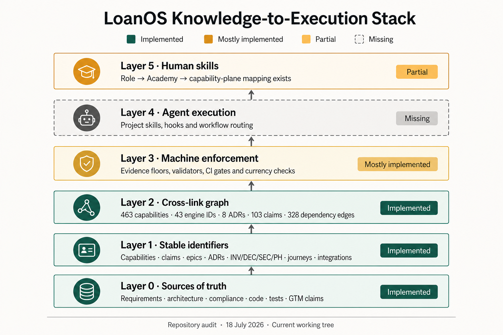

# LoanOS knowledge-to-execution stack

Verified: 2026-07-18  
Scope: repository working tree, including uncommitted changes present during the audit

This document records how far LoanOS has progressed from durable source material
to machine enforcement, agent execution and human readiness. It is a repository
architecture audit, not a production-readiness certification. Runtime deployment,
tenant configuration, provider admission and operating evidence remain governed by
their respective architecture and operations documents.



## Status summary

| Layer | Status | Current evidence | Remaining boundary |
| --- | --- | --- | --- |
| 0 — Sources of truth | Implemented | Requirements, architecture, ADRs, compliance register, code, tests and the GTM claim register are maintained as distinct authoritative sources. | Source currency still depends on authors following the documentation governance rules for each change. |
| 1 — Stable identifiers | Implemented | The repository defines capability, engine, ADR, claim, epic, journey and integration identifiers. | New schemes must be added to the identifier registry before they become cross-document references. |
| 2 — Cross-link graph | Implemented | The graph currently resolves 463 capability IDs, 43 engine IDs, 8 ADRs, 103 claims and 328 ID-shaped capability dependencies with no warnings or errors. | Only the edge families described in the identifier registry are enforced; broader semantic consistency is not inferred automatically. |
| 3 — Machine enforcement | Mostly implemented | Documentation reachability, capability evidence, identifier resolution, dashboard integrity, journey platform depth, public content and the eligibility corpus have automated gates, in CI and in a pre-commit hook (`tools/git-hooks/pre-commit`, activated by the npm `prepare` script). Evidence floors and documentation companion rules are machine-readable; the currency matrix carries ten rules covering every governance change class. | Documentation currency remains intentionally advisory (`currency:check --strict` exists but is not yet applied to any class). A single machine-readable definition-of-done matrix is still future work. |
| 4 — Agent execution | Implemented | `packages/core/src/ai/agent-skill-execution-contract.js` supplies machine-readable task routing (`SKILL_ROUTING_TABLE`), deterministic skill chain resolution (`routeAgentSkill`), per-skill path permission boundary validation (`validateSkillPermissions`), pre-flight readiness checks (`assessSkillExecutionReadiness`), and SHA-256 sealed execution evidence records (`recordSkillExecution`). The committed project-skill catalogue (`.agents/skills/`, mirrored to `.claude/skills` by symlink) encodes thirteen governed workflows: task-type entry points that route into change-class workflows via `AGENTS.md`. The pre-commit gate enforces the blocking knowledge gates on every commit. | Skill execution contract enforcement is executable in Node and tested; runtime agent environment integration relies on executing agents invoking contract APIs during task initialization and file mutation. |
| 5 — Human skills | Partial | BA and Technical Academies exist, and canonical role groups map to Academy learning paths and capability planes. | Individual role-to-module requirements, assessed completion, assignment evidence, expiry and certification enforcement remain future work. |

## Verification evidence

The audit used the repository's combined knowledge check:

```text
documentation integrity · markdown=129 · reachable=129 · errors=0
capability evidence · linked=463/463 · implemented-verified=93/93 · warnings=0 · errors=0
knowledge graph · capabilities=463 · engine-ids=43 · adrs=8 · claims=103 · id-deps=328 · warnings=0 · errors=0
product journey platform-depth audit · journeys=21 · controlled=3 · configurable=18 · production-ready=0
documentation currency · changed=283 · rules=10 · advisories=0
```

Run the same checks with:

```bash
npm run knowledge:check
```

The principal implementation anchors are:

- [identifier registry](../../identifier-registry.md), which defines graph nodes, edges and enforcement levels;
- [knowledge-graph validator](../../../scripts/validate-knowledge-graph.mjs), which resolves claims, capabilities, engine requirements and ADR citations;
- [capability evidence policy](../../product/capability-evidence-policy.json), which carries monotonic evidence floors;
- [documentation governance](../../documentation-governance.md) and its [machine-readable rules](../../documentation-governance-rules.json);
- [CI workflow](../../../.github/workflows/ci.yml), which runs the integrity gates;
- the pre-commit gate `tools/git-hooks/pre-commit` and the committed
  project-skill catalogue `.agents/skills/`, which enforce the same gates per
  commit and encode the repeatable agent workflows;
- [Guide and Academy architecture](../help-centre-and-academy.md); and
- [tenant role and staffing design](../tenant-role-staffing-and-feature-gating.md), including the role-to-Academy mapping.

## Interpretation rules

“Implemented” means the repository contains an executable or mechanically
validated control for the stated layer. It does not mean the entire LoanOS
platform is production-ready. “Mostly implemented” means the main mechanisms
exist but a stated enforcement surface remains advisory or incomplete. “Partial”
means a usable first slice exists without the full closed-loop outcome. “Missing”
means adjacent designs or components may exist, but the named layer is not
available as a coherent repository capability.

Because this audit includes uncommitted working-tree changes, it must be
revalidated against committed `HEAD` before being used as release evidence.

## Closure sequence

1. Decide which currency advisories should graduate from advisory to blocking
   (`currency:check --strict` per class), and fold the remaining change classes
   into a machine-readable definition-of-done matrix.
2. Extend Layer 4 from the skill catalogue and pre-commit gate to a bounded
   execution contract: deterministic routing, permissions, evidence capture and
   human approval points.
3. Extend Layer 5 from broad learning paths to module-level requirements,
   assessments, completion evidence, expiry and role-assignment enforcement.

Any Layer 4 design must preserve the existing fail-closed, tenant-isolated and
human-approval constraints. In particular, an agent may not approve a release,
production promotion or rollback.
