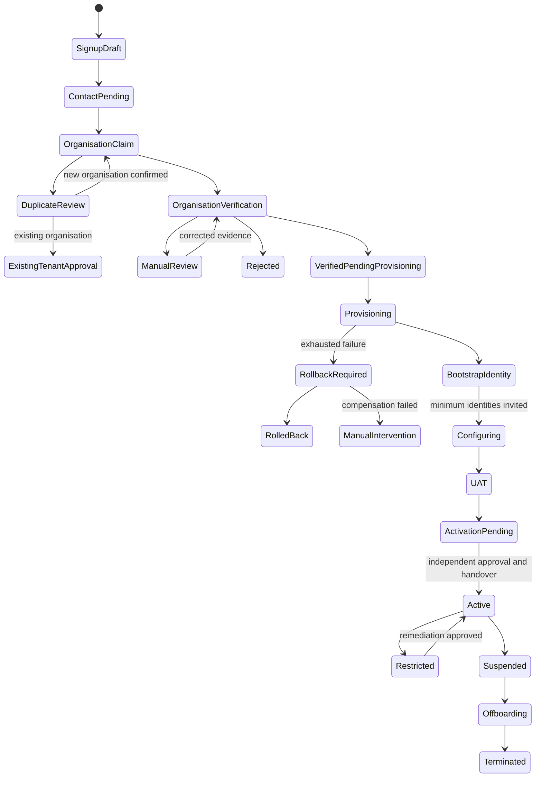

# Organisation Signup and Bootstrap Identity Architecture

## Purpose

This document defines the greenfield journey from the first representative of a regulated entity (RE) arriving at LoanOS through a safely activated, staffed and provisioned tenant. It also defines how every later user joins, how authority is separated, and where identity onboarding joins product onboarding and infrastructure provisioning.

The design assumes zero migrated users and no backward-compatibility obligation. A tenant is never made production-active merely because a person completed a web form or because infrastructure exists. Identity, organisational authority, deployment readiness, product readiness and independent launch approval are distinct gates.

This is the architecture view. The executable contracts and persistence design are in [organisation-signup-detailed-design.md](organisation-signup-detailed-design.md), and operational procedures are in [organisation-signup-operations.md](organisation-signup-operations.md).

## Scope

In scope:

- public signup, email/mobile verification and abuse prevention;
- creation of a new organisation or a governed claim against an existing one;
- legal-entity, RE-licence and authorised-representative verification;
- duplicate-organisation and corporate-domain handling;
- creation of the tenant control-plane record without premature activation;
- temporary first-user bootstrap authority;
- invitation, activation and lifecycle of all later users;
- local authentication, mandatory MFA, enterprise federation and SCIM;
- one canonical tenant RBAC catalogue, permissions, scopes and separation of duties (SoD);
- minimum role/person coverage before UAT and production;
- selection of subscription, products and deployment model;
- joining the signup journey to deployment blueprint and provisioning saga;
- retries, rollback, reconciliation, support intervention, audit and evidence;
- suspension, abandonment, ownership transfer and recovery during onboarding.

Out of scope:

- borrower/customer onboarding and borrower authentication;
- credit policy, loan processing or servicing workflow design;
- vendor-specific KYC, MCA, GSTN, RBI, UIDAI, telecom or payment payloads;
- commercial price construction, invoicing and collections beyond recording the accepted commercial reference;
- workforce HR lifecycle beyond identity provisioning and access governance;
- migration of legacy tenant or user identifiers. This is a greenfield contract.

## Principles and invariants

| ID | Invariant |
| --- | --- |
| ORG-INV-1 | A verified person is not a verified organisation, and a verified organisation is not an active tenant. |
| ORG-INV-2 | The first registrant never receives permanent auditor authority or the right to approve their own production activation. |
| ORG-INV-3 | Bootstrap authority is tenant-bound, purpose-bound, time-bound and automatically reduced when its exit conditions are met. |
| ORG-INV-4 | Every user, invitation, role grant, approval, session and evidence object is tenant-bound; cross-tenant lookup fails closed. |
| ORG-INV-5 | Unknown roles, permissions and scopes are rejected, never silently removed or converted to defaults. |
| ORG-INV-6 | Role grants are version-bound to the canonical role catalogue and evaluated with explicit SoD constraints. |
| ORG-INV-7 | No individual may propose and approve the same privileged grant, irreversible provisioning action or production activation. |
| ORG-INV-8 | A tenant cannot become active until minimum independent-person coverage, MFA/federation readiness, deployment readiness, product UAT and handover are evidenced. |
| ORG-INV-9 | Signup, tenant creation and provisioning accept idempotency keys; the same key and same payload replay the result, while the same key and different payload fail. |
| ORG-INV-10 | Provisioning is resumable and reconciliable. Reversible actions compensate in reverse order; irreversible actions require prior approval and witness evidence. |
| ORG-INV-11 | Secrets, OTPs, passwords, raw invitation tokens and identity-document bodies never enter audit events, URLs, logs or general onboarding records. |
| ORG-INV-12 | Authentication and authorisation fail closed when identity, tenant, policy version, role scope, evidence or dependency is absent or stale. |
| ORG-INV-13 | Tenant suspension blocks tenant data-plane use without destroying evidence, recovery access or contractual exit capability. |
| ORG-INV-14 | Product addition and later user onboarding cannot reopen, mutate or de-authorise unrelated active products except through a separately approved change. |

## Actors and trust boundaries

| Actor | Boundary and authority |
| --- | --- |
| Prospective representative | Untrusted public user until contact methods and organisation authority are verified. May only operate their signup case. |
| Bootstrap owner | First verified authorised representative. Temporarily configures the organisation, invites required officers and selects initial products; cannot self-approve launch. |
| Tenant owner | Accountable tenant executive role after bootstrap reduction. Can nominate administrators but is not an all-powerful technical superuser. |
| Identity administrator | Manages users, invitations, federation mapping and access requests. Cannot certify their own access review. |
| Security administrator | Manages MFA/federation/security policy and emergency access. Cannot act as independent security auditor for their own changes. |
| Product/configuration administrators | Configure entitled product, workflow, channel and integration objects within assigned scopes. |
| Business makers/checkers | Execute and independently approve regulated business actions according to product/amount/unit scopes. |
| Compliance, risk, finance and audit officers | Own control readiness and evidence. Audit is read-only and organisationally independent. |
| LoanOS platform operator | Operates the SaaS control plane and provisioning workers. Has no implicit tenant business authority. |
| LoanOS verifier/support | Reviews exceptions with case-scoped, time-limited access; cannot silently mutate tenant data. |
| External verification provider | Supplies signed/traceable verification results; cannot activate a tenant. |
| Enterprise identity provider | Authenticates federated users and supplies governed claims; LoanOS still authorises every request. |
| SCIM client | Proposes user/group lifecycle changes within an approved mapping and tenant boundary. |
| Provisioning worker | Performs one leased, fenced saga step and records evidence. It does not decide readiness. |
| Independent approver/witness | Approves privileged or irreversible actions and accepts handover; must differ from proposer/executor where specified. |

The public identity plane, SaaS control plane, tenant data plane, external verification providers and each per-tenant decision runtime are separate trust zones. A contact-verification token cannot authenticate a tenant data-plane request. A platform operator credential cannot be projected into a tenant role. Federation supplies identity assurance, not business authority.

## Aggregate boundaries

The system deliberately separates these aggregates:

1. **Signup case** — contact verification, consent, representative details, organisation claim and abuse state.
2. **Organisation** — legal identity, regulated-entity attributes, domains and verification decisions.
3. **Tenant** — contract, subscription, deployment model, lifecycle and data-plane locator.
4. **Identity** — a human or service principal, authenticators, status and federation linkage.
5. **Invitation/access request** — proposed tenant membership and requested grants.
6. **Role catalogue and grant** — immutable role version, permissions, resource scope, effective interval and approval evidence.
7. **Provisioning saga** — infrastructure/configuration steps, leases, checkpoints, compensation and handover.
8. **Getting-started session** — products, configuration, providers, finance/compliance, migration, training and UAT readiness.
9. **Activation decision** — the immutable join of organisation, identity, deployment, product and operational evidence.

None of these aggregates is inferred solely from another. For example, an organisation may be verified while provisioning is blocked, and infrastructure may be provisioned while minimum staffing is incomplete.

## Platform admission and enhanced due diligence

Signup means applying to become a LoanOS SaaS customer. It never instantly creates an active tenant, production credential, RE-branded public page, DLA association, borrower channel or live integration. The detailed admission gates and official-source applicability boundary are maintained in [Platform Admission and Organisation Verification Control Map](../compliance/platform-admission-control-map.md).

This is **LoanOS vendor/customer admission**, not the RE's KYC of a borrower. The [RBI KYC Direction, 2016, updated November 6, 2024](https://systemhealth.rbi.org.in/Scripts/BS_ViewMasDirections.aspx_id%3D11566%282%29.html) describes RE customer acceptance, customer identification and legal-entity CDD. Those borrower obligations remain in LoanOS borrower KYC/AML modules. LoanOS applies separate, proportionate organisation and representative verification to protect the platform, validate the contracting relationship and prevent false claims; it does not claim RBI approval or completion of the RE's borrower KYC or its own outsourcing assessment.

The architecture is informed by these current official sources:

- the [RBI Outsourcing of Information Technology Services Directions, April 10, 2023](https://www.rbi.org.in/scripts/FS_Notification.aspx?Id=12486&Mode=0&fn=14), which require applicable REs to govern, assess, contract with, monitor and plan exit from IT service providers without diminishing the RE's responsibility;
- the [RBI Annual Report 2024–25](https://www.rbi.org.in/scripts/AnnualReportPublications.aspx?Id=1436), which discusses false RE associations/illegal DLAs and the 2025 digital-lending framework;
- official MCA company/LLP master-data surfaces, the [GST Search Taxpayer guidance](https://tutorial.gst.gov.in/userguide/taxpayersdashboard/Search_Taxpayer_manual.htm), Income Tax Department PAN verification and RBI regulated-entity directories identified in the control map;
- the [Digital Personal Data Protection Act, August 11, 2023](https://www.meity.gov.in/static/uploads/2024/02/Digital-Personal-Data-Protection-Act-2023.pdf) and official [DPDP Rules, November 14, 2025](https://www.meity.gov.in/documents/act-and-policies/digital-personal-data-protection-rules-2025-gDOxUjMtQWa), applied according to their commencement schedule; and
- [CERT-In's directions under section 70B dated April 28, 2022](https://cert-in.org.in/Directions70B.jsp), which inform incident reporting, secure operations, time synchronisation and log preservation.

### Admission gates

| Gate | Evidence and decision |
| --- | --- |
| Human contact | Verified corporate email and Indian mobile where policy requires; single-purpose challenges, bounded attempts and neutral responses. |
| Representative identity | Approved identity-provider result and evidence reference; no biometric/Aadhaar authentication secret stored. |
| Representative authority | Board resolution, authority letter, DSC/EVC or independently confirmed corporate authority. Contact possession alone is insufficient. |
| Legal existence | CIN/LLPIN or other applicable registration, legal name/status/registered office from official evidence. |
| Tax identity | PAN and applicable GSTIN name/status match. A mismatch blocks or enters EDD; it is not silently corrected. |
| Regulated authority | Claimed RBI/NHB/other category, CoR/licence number, activity and current official status. An unverified RE claim cannot enter production. |
| Domain control | DNS/file/mailbox proof plus official-record cross-check. It supports, but never replaces, legal/authority verification. |
| Relationship and outsourcing | Executed commercial/DPA/SLA/order terms, named RE sponsor, risk tier, audit/regulator access, incident, subcontractor, BCP/DR and exit acceptance. |
| Abuse/fraud | IP/device/contact/domain/legal-identifier velocity, disposable or anomalous domain, duplicate relationship and internal denylist signals. |
| Sanctions/adverse risk | Policy-required entity/representative screening with false-positive/manual review and explainable evidence. |
| Security bootstrap | Owner-controlled credential, MFA, recovery, independent second administrators/checkers and no self-approved high-risk authority. |
| Provisioning/launch | Approved blueprint, completed saga, product/configuration/provider/UAT/finance/compliance/security readiness and independent handover. |

Automated verification may clear unambiguous low-risk facts, but discrepancies, elevated risk and non-automatable authority enter trained manual review. Outcomes are `request_information`, `enhanced_due_diligence`, `approve`, `approve_with_conditions` or `reject`; production remains blocked until all pre-activation conditions close. Rejection records reason codes and permits correction or independently reviewed appeal where lawful and safe, without disclosing fraud logic, sanctions-sensitive detail or another tenant's existence.

Admission is not a one-off control. Legal/licence status, authorised representatives, ownership/control, domain, contract, products/DLAs/LSP relationships, deployment and adverse/security changes trigger risk-based reverification. Material unresolved change may proportionately restrict branding, new origination, administrative change or the tenant, while preserving audit, customer protection and exit duties.

## Lifecycle state model

### Signup and organisation claim

`draft → contact_verification_pending → organisation_claim_pending → organisation_verification_pending → organisation_verified`

Alternative terminal or holding states are `abandoned`, `expired`, `rejected`, `duplicate_review`, `manual_review` and `verification_retry`. A rejected case is immutable; correction creates a linked revision. Duplicate review may join the representative to an existing tenant only after that tenant independently approves the claim.

### Tenant lifecycle

`reserved → verified_pending_provisioning → provisioning → bootstrap_identity → configuring → uat → activation_pending → active`

Operational states after launch are `restricted`, `suspended`, `offboarding` and `terminated`. Failure states during onboarding are `provisioning_failed`, `rollback_required`, `rolling_back`, `rolled_back` and `manual_intervention`. `active` can only be entered by an activation decision, not by tenant creation.

### User lifecycle

`invited → contact_verified → identity_verified → credentials_enrolled → mfa_enrolled → role_acceptance_pending → training_pending → active`

Optional enterprise branches are `federation_pending → federated_active` and `scim_pending → scim_managed`. Holding/terminal states are `expired`, `revoked`, `suspended`, `locked`, `access_review_overdue`, `deprovisioning` and `deactivated`. A user may exist without active grants; deactivating an identity does not delete its audit lineage.

### Bootstrap owner lifecycle

`candidate → representative_verified → bootstrap_active → minimum_staffing_pending → reduction_pending → reduced`

Bootstrap authority expires at the earliest of: successful reduction, explicit revocation, tenant rollback/termination, or the configured maximum bootstrap window. Extension is an independently approved exception. The bootstrap owner may invite and configure, but cannot grant themselves new permanent privileged roles, approve an incompatible grant, accept production handover, or serve as the independent auditor/checker required for launch.

## End-to-end first-user journey

1. The representative starts a signup case and accepts the versioned privacy notice, terms and communications choices. The service returns an opaque case reference; no tenant exists yet.
2. Email and, where policy requires, Indian mobile are verified using one-time, single-purpose, short-lived challenges. Abuse controls assess velocity, reputation, device and duplicate indicators without making an opaque credit-like decision.
3. The representative identifies the organisation using legal name, entity type, CIN/LLPIN or equivalent, PAN, GSTIN where applicable, RBI registration/licence category and registered-office information.
4. The system searches exact and fuzzy organisation keys. A possible match enters duplicate review. Joining an existing organisation requires an invitation or independent approval from that tenant; domain ownership alone is insufficient.
5. Organisation and authorised-representative checks run through configured providers or a manual evidence workflow. Each fact records source, timestamp, provider transaction reference, result and evidence checksum.
6. An independent verifier approves the organisation claim when manual approval is required. Rejected or discrepant facts produce coded findings and a correction path.
7. The control plane reserves a globally unique tenant identifier, binds the verified organisation and accepted commercial/subscription references, and records `verified_pending_provisioning`. It does not set `active`.
8. The first user activates a single-use bootstrap invitation, chooses their own credential or completes federation, and enrolls phishing-resistant MFA when available (TOTP is the baseline). No LoanOS employee chooses or sees the password.
9. The bootstrap owner selects the deployment model and initial built-in/platform/tenant-derived products. The approved deployment blueprint compiles a tenant-specific plan and the provisioning saga begins.
10. The owner completes organisation structure and invites the required independent people. Each invitation names precise roles/scopes, approval requirements and expiry; invitees must verify identity, enroll MFA, accept role duties and complete required training.
11. Role coverage and SoD are continually assessed. Missing officers, one-person conflicts, stale training, inactive MFA or over-broad scopes block progress.
12. Products, workflows, integrations, finance/compliance, reporting, migration/data setup and operational arrangements are configured. Provider simulation may support sandbox testing but never satisfies live-provider evidence.
13. Tenant UAT, security, resilience, finance and compliance readiness complete. Deployment and getting-started projections supply immutable evidence references to the activation decision.
14. A person independent of the bootstrap owner and provisioning executor approves launch. Operations accepts handover. Only then does the tenant enter `active` and production data-plane routes become available.
15. Bootstrap permissions are reduced to the separately approved permanent role set. If no permanent grant was approved, the first user retains ordinary membership only.

## Journey for the second and every later user

1. An authorised identity administrator creates an access request or sends an invitation; SCIM may propose the same operation after federation is approved.
2. The request declares identity, employment/contract relationship, manager/sponsor, role IDs and versions, product/unit/channel/partner scopes, start/end dates and business justification.
3. The policy engine validates known roles, licence/training prerequisites, minimum/maximum scope, incompatible-role rules, privileged status and whether independent approval is required.
4. The invite is delivered through a configured channel. Only a hash of the token is stored. Resend revokes the earlier token. Revoke, expiry and first successful use make it unusable.
5. The invitee verifies the intended address, proves identity to the configured assurance level, enrolls credential and MFA/federation, reviews responsibilities and explicitly accepts the proposed grants.
6. Required approvers resolve the exact request checksum. Any material edit creates a new revision and invalidates approvals.
7. Training/certification and employment status are verified. The identity becomes active only when every mandatory condition holds.
8. Provisioning to applications/queues/groups is asynchronous and reconciled. Partial downstream success does not grant broader LoanOS permissions.
9. Login and each regulated action evaluate current identity, tenant state, session assurance, role-version, resource scope and SoD. Cached authorisation must have a short bound and revocation signal.
10. Joiner/mover/leaver, periodic access review and emergency suspension use the same canonical grant records. Deactivation revokes sessions, tokens and downstream assignments while preserving audit evidence.

## Canonical RBAC architecture

Permissions are stable verbs over resource types. Roles are versioned permission bundles. Grants bind an identity to a role version, tenant, resource scope and effective interval. Business workflow roles and administrative roles use one catalogue and one evaluator even when displayed in different UI groupings.

### Role families

| Family | Canonical roles | Purpose |
| --- | --- | --- |
| LoanOS platform | `platform_admin`, `tenant_provisioner`, `platform_security_admin`, `platform_auditor`, `support_engineer`, `release_operator`, `release_approver` | LoanOS control-plane operation. These are never tenant roles and confer no RE business authority. |
| Temporary bootstrap | `bootstrap_owner`, `bootstrap_checker` | Time-limited setup/proposal and independent bootstrap review; never permanent audit or launch authority. |
| Tenant administration | `tenant_owner`, `tenant_admin`, `user_admin`, `security_admin`, `access_reviewer`, `auditor`, `operator`, `integration_admin`, `workflow_admin` | Accountable ownership, identity/security/configuration administration, independent access/audit and ordinary operations. |
| Product governance | `product_manager`, `product_approver`, `journey_admin`, `product_owner`, `product_checker` | Product-scoped configuration, ownership and independent change approval. |
| Credit/KYC/operations | `loan_officer`, `credit_maker`, `credit_officer`, `credit_checker`, `operations_maker`, `operations_checker`, `kyc_officer`, `kyc_checker`, `human_reviewer`, `disbursement_maker`, `disbursement_checker` | Regulated origination execution and four-eyes approval. |
| Servicing/customer control | `collections_manager`, `grievance_officer` | Collections management and independent grievance control. |
| Risk/compliance/reporting | `portfolio_risk_manager`, `compliance_officer`, `compliance_analyst`, `principal_officer`, `reporting_officer`, `security_officer`, `data_protection_officer`, `model_risk_manager` | Risk, AML/FIU, regulatory reporting, privacy, security-interest and model control. |
| Finance | `finance_admin`, `finance_maker`, `finance_checker` | Finance configuration and maker-checker accounting/settlement authority. |

Role display labels may be localised; canonical IDs cannot be tenant-renamed. Tenants may create custom roles only from an allow-listed permission set and after SoD simulation. Custom roles do not bypass prerequisite, privileged-role or minimum-staffing rules.

### Scope dimensions

Every grant specifies one or more of: legal entity/programme, product, branch/operating unit, geography, channel/partner, workflow queue, portfolio, amount/delegated-authority band, environment and data class. `*` is prohibited for partner/support roles and independently approved for privileged administrators.

### Minimum staffing for activation

The minimum is based on distinct active humans, not role counts. A larger RE may configure stricter thresholds.

| Capability | Minimum production coverage | Independence rule |
| --- | ---: | --- |
| Accountable tenant ownership | 1 | Cannot alone approve activation. |
| Tenant and identity administration | Active `tenant_admin` and `user_admin` coverage | Auditor/operator do not count as effective administrators; production staffing should name backup administrators. |
| Security administration | Active `security_admin` coverage | Security change approver differs from maker; `auditor` cannot coexist on the same principal. |
| Product/business governance | Active `product_manager` per required tenant/product scope | Product change checker/approver differs from configurator. |
| Credit maker-checker | Active `credit_maker` and `credit_checker` | Must be distinct people for one case and overlapping scope. |
| Operations maker-checker | Active `operations_maker` and `operations_checker` | Must be distinct people for one case and overlapping scope. |
| Compliance approval | Active `compliance_officer` | Cannot be the product configurator for the same launch approval. |
| Finance maker-checker | 2 distinct people where finance is enabled | Journal/payment maker differs from checker. |
| Operational support liaison | 2 contacts | Primary and backup on-call paths. |
| Audit/access review | Active independent `auditor`; use `access_reviewer` for access certification | Read-only/control roles; cannot administer the subject identities or security. |
| Production activation | proposer, approver and operations acceptor | Approver differs from proposer; acceptor differs where policy marks handover three-party. |

The implemented domain baseline additionally requires at least three distinct active, verified principals across the mandatory launch catalogue. The production admission policy may require more people or backups by RE size, product, deployment or risk tier; it may never reduce maker-checker pairs to one person.

During a narrowly bounded bootstrap window, the first user may cover tenant ownership, business ownership and maker-side configuration. They do not satisfy the independent checker, audit, security-review or activation-approval positions.

### Mandatory incompatible-role rules

- maker and checker for the same action domain and overlapping scope;
- identity administrator and access reviewer for the same population/review;
- security administrator and security auditor for the same control/change;
- product configurator and product launch approver for the same product/version;
- finance maker and finance checker for overlapping entity/account scope;
- payment/release maker and approver;
- provisioning executor and irreversible-step approver;
- support user and tenant business operator;
- internal auditor and any write-capable tenant role under audit;
- bootstrap owner and production activation approver.

Some roles may coexist globally but cannot act on the same object (transactional SoD); others are prohibited from simultaneous assignment (static SoD). The evaluator must support both.

## Identity assurance, MFA, federation and SCIM

Local authentication is supported for bootstrap and fallback, but every privileged user must enroll MFA before authority becomes effective. Recovery codes are one-time, hashed and shown once. MFA reset is a high-risk workflow requiring verified recovery, cooldown, session revocation and independent approval for privileged users. SMS must not be the sole privileged-user factor.

Federation is configured only after domain verification, signed metadata/key validation, issuer/audience/clock checks, break-glass account setup and a tested rollback. Just-in-time creation is disabled by default; an approved invitation or SCIM record must pre-authorise membership. Identity-provider groups map to canonical role requests, not directly to permissions, and unknown groups fail closed.

SCIM tokens are tenant-specific, secret-managed, scoped and rotated. Create/update/deactivate operations are idempotent by external ID. SCIM cannot grant bootstrap owner, auditor, tenant owner or other designated high-risk roles without an independently approved LoanOS access request. Deactivation is urgent and revokes sessions immediately; deletion remains a soft-deactivation plus retention workflow.

At least two tested break-glass identities are required before federation enforcement. Their credentials are vaulted, MFA protected, monitored, time-bound when activated and excluded from ordinary daily work.

## Deployment and provisioning join

The selected deployment model references an approved, immutable blueprint for one of:

- shared multi-tenant;
- dedicated tenant data plane;
- dedicated environment;
- customer-managed private.

The tenant provisioning plan covers tenant namespace, application/data partition, database isolation, per-tenant decision runtime, keys/secrets, network/domain/certificates, storage/WORM, queue/workers, integrations, monitoring/SIEM, backup/PITR/DR, capacity/SLO, release/upgrade, support operations, India residency and portability/exit.

Organisation verification supplies the tenant binding. Bootstrap identity supplies accountable owners and approvers. Product selection supplies entitlements and configuration scope. The deployment blueprint supplies topology and responsibility ownership. These become inputs to the revisioned provisioning saga in `packages/core/src/platform/tenant-provisioning-saga.js`; none substitutes for another.

The current saga dependency order is isolation foundation, security/audit foundation, RE and administrator authority, product entitlements/configuration/workflows, channels/integrations, finance/compliance, migration, UAT and activation. Migration and activation are irreversible boundaries. In a truly greenfield tenant, `migration` means certified initial/reference/opening data load or an explicitly approved no-data checkpoint, not legacy-user migration.

## Failure, rollback and recovery model

- A failed verification provider call enters bounded retry or manual verification; it never becomes a pass.
- Duplicate legal identifiers or domains quarantine the case; they do not merge automatically.
- Contact/token replay returns the original safe result or a generic invalid response without leaking account existence.
- Concurrent signup completion uses aggregate revision/CAS and idempotency records. Exactly one tenant may bind to a verified organisation claim.
- Provisioning workers use leases and fencing tokens. Completion from an expired worker is rejected.
- Before an irreversible boundary, cancellation compensates completed reversible steps in reverse dependency order.
- After an irreversible boundary, the approved rollback/runbook determines restriction, data preservation and forward recovery; destructive automatic cleanup is prohibited.
- Compensation failure enters `manual_intervention` with a case owner, incident link, evidence and next-action SLA.
- External reality is reconciled by signed/verified checkpoints. Reconciliation may adopt a valid same-tenant checkpoint after dependency validation; conflicting checksums fail closed.
- If the first owner disappears, an authorised-representative recovery case requires new organisation evidence and independent LoanOS approval. Support cannot simply reassign ownership.
- If a required officer leaves before launch, role coverage becomes blocked and activation approvals that relied on that officer are invalidated.

## Threat, abuse, privacy and evidence controls

The threat model includes automated signup abuse, enumeration, credential stuffing, phishing, invitation theft, SIM swap, malicious domain claims, forged corporate/RE records, duplicate tenant creation, insider provisioning, confused deputy across tenants, excessive roles, SoD evasion through custom roles, SCIM/federation claim injection, stale worker completion, evidence substitution and audit-log secret leakage.

Controls include uniform public responses, bounded rate/velocity limits, bot/risk challenges, verified contact possession, signed provider results, manual exception review, exact tenant/resource binding, short-lived single-use tokens, mandatory MFA, session rotation, canonical role validation, independent approval, checksum-bound evidence, WORM/audit anchoring, India-resident storage, least-data collection and purpose/retention metadata.

Applicant personal data is held in a public-signup privacy partition before tenant creation. Failed/abandoned cases are retained only for the approved fraud, legal and operational period, then redacted/deleted while preserving non-identifying audit proof. Identity documents are stored in the protected evidence vault, not general JSON records. Provider data sharing records purpose, legal basis/consent, fields, recipient, country, retention and deletion obligation.

## Implemented versus target capability

The following distinction is mandatory in sales, architecture reviews and release decisions.

### Implemented control-plane/domain capability in this repository as of 2026-07-15

- tenant-scoped sessions/API keys, file/Postgres storage and PostgreSQL RLS controls;
- tenant user creation, invitation token hashing/expiry/acceptance, password hashing, TOTP enrollment and session/login lockout primitives in `apps/api/src/identity.js` and routes in `apps/api/src/server.js`;
- a pure organisation-signup/admission state machine in `packages/core/src/platform/organisation-signup.js`: hashed contact challenges, organisation/legal/tax/licence evidence, duplicate checks, corporate-domain and authorised-representative proof, legal acceptance, fraud/device/rate/sanctions/adverse assessments, four-eyes admission, rejection appeal/reverification, first-owner invitation/MFA evidence, provisioning request, cancellation/expiry, idempotency, audit/outbox and a permanently false `tenantActive` projection;
- a canonical role/SoD domain kernel in `packages/core/src/identity/saas-identity-governance.js`: exact role validation, tenant-scoped principals, expiring bootstrap owner/checker, maker-checker grants/revocations, hard SoD, minimum launch coverage, bootstrap reduction, last-effective-admin protection, ownership transfer, emergency access and fail-closed action projection;
- a persistent file-store HTTP slice for case-secret-bound public contact/organisation/proof/legal submission, session-bound two-person platform admission, quarantined tenant reservation, single-use first-owner invitation, user-chosen password/TOTP enrollment and provisioning request; the opaque case ID alone cannot authorise mutation, and generic activation, direct production tenant minting and public tenant branding remain blocked;
- a persistent canonical identity-governance API under `/admin/identity-governance` for MFA-verified principal binding, temporary owner/checker authority, catalogue/SoD projection, session-bound maker-checker grants/revocations, launch coverage, bootstrap reduction, ownership transfer and emergency access. Role coverage is synchronised into the tenant activation gates;
- provisioning-session enforcement: the first owner and next checker can use only MFA/password resolution and the governed bootstrap control plane. General tenant administration, public branding and lending data-plane routes remain unavailable until activation;
- end-to-end integration coverage from verified signup through first-owner login, canonical owner binding, second-user invitation, user-chosen password, mandatory MFA, canonical checker binding and restricted checker login, plus activation-bypass and direct-production-mint rejection;
- federation/SCIM governance primitives and enterprise-platform tests;
- 21 built-in product templates, tenant entitlements, getting-started orchestration and product readiness controls;
- four deployment blueprint models and readiness assessment in `packages/core/src/platform/saas-deployment-blueprints.js`;
- resumable/fenced provisioning, retry, compensation, reconciliation and handover primitives in `packages/core/src/platform/tenant-provisioning-saga.js`;
- audit-chain, evidence, implementation/UAT, recovery, observability and operational-control primitives.

### Still pending for a production-complete signup service

- public signup/operator UI, PostgreSQL persistence, complete appeal/reverification/operations API coverage and production delivery/verification adapters; the initial file-store API slice is implemented;
- authoritative live MCA/GSTN/RBI/PAN/domain/representative verification adapters and commercial vendor agreements;
- delivery of signup/invitation OTPs through certified live email/SMS providers;
- the canonical catalogue/SoD evaluator wired to every existing business route and removal of the older split administration/workflow role paths; canonical identity administration is persistent, but it is not yet the universal runtime authoriser;
- scheduled bootstrap expiry, downstream session/group reconciliation and self-service ownership recovery around the implemented domain transitions;
- one transactional join from verified signup through tenant reservation, provisioning and activation;
- production provisioning workers/adapters for cloud, DNS, KMS/HSM, database, queues, WORM, monitoring, backup and private deployment;
- self-service admin UI for invitations, role coverage, federation, deployment progress and activation evidence;
- completion of the current integration journey through provisioning checkpoints, UAT/handover, independent activation, suspension and deprovisioning using production-like infrastructure and real provider sandboxes.

Mocks and deterministic simulators are valid for development and adverse-path conformance. They are not live-integration or production-readiness evidence.

## Architecture acceptance criteria

- Every state transition, role grant and saga checkpoint has positive, negative, replay, concurrency and cross-tenant tests.
- The public first-user journey is tested from signup through active tenant without direct state seeding.
- The second-user journey is tested through invite delivery, acceptance, MFA/federation, approval, training, activation, suspension and deprovisioning.
- Unknown roles/scopes fail rather than disappear; all legacy/disconnected role names are removed or mapped in an explicit one-time greenfield catalogue construction, not runtime aliases.
- No activation path bypasses organisation verification, minimum staffing, SoD, deployment readiness, product/UAT readiness and independent handover.
- Every failure state has an operator-owned recovery path and evidence.
- Shared, dedicated and customer-managed deployment models pass isolation, rollback, DR and exit exercises appropriate to their responsibility matrices.
- Security/privacy review, threat model, operations readiness, support training and independent control assurance are complete before production release.
