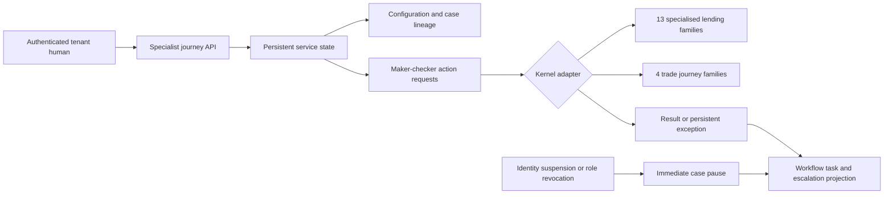

# Persistent specialist journey service

## Purpose and boundary

This is the JD-02 architecture for the 17 lending journeys that previously existed only as deterministic domain kernels: thirteen specialised lending families and four working-capital/trade families. It provides one tenant-persistent control and execution boundary. It does not create 17 services and it does not claim that any journey is production-ready.

The service owns governed specialist configuration, version-bound cases, independently approved actions, kernel invocation, exceptions, pause/escalation and workflow projection. Common borrower onboarding, KYC, underwriting decision, KFS, contracting, disbursement, LMS, accounting, reporting and closure remain the JD-04 composition boundary. JD-03 schema-driven channel workspaces now consume this service boundary without changing it.

## Covered journey types

| Kernel | Canonical journey types |
| --- | --- |
| Specialised lending | `agriculture_allied_finance`, `commercial_vehicle_finance`, `consumer_durable_finance`, `education_loan`, `equipment_machinery_finance`, `gold_loan`, `green_equipment_finance`, `home_loan`, `loan_against_property`, `microfinance_group_lending`, `personal_vehicle_loan`, `professional_practice_loan`, `secured_business_loan` |
| Trade | `invoice_discounting`, `purchase_order_finance`, `supply_chain_finance`, `trade_finance_workflow` |

The exact list is exported as `PERSISTENT_SPECIALIST_JOURNEY_TYPES`; tests require 13 + 4 = 17.

## Architecture

`packages/core/src/journeys/specialist-journey-service.js` is pure domain orchestration. `apps/api/src/routes/specialist-journeys.js` derives tenant and actor authority from the authenticated request. The file and PostgreSQL stores persist the same tenant-data document; PostgreSQL applies the existing tenant row-level-security and advisory-lock boundary.

## Persisted state

| Collection | Purpose |
| --- | --- |
| `specialistJourneyConfigurationRequests` | Immutable, checksum-bound configuration proposals and approval result. |
| `specialistJourneyConfigurations` | Active/suspended exact template, schema, policy, workflow, accounting and kernel-version binding. |
| `specialistJourneyCases` | Tenant case identity, source/subject, assigned principals, configuration checksum/version, state and history. |
| `specialistJourneyActionRequests` | Immutable proposed payload, independent approval and checksummed result. |
| `specialistJourneyExceptions` | Fail-closed kernel errors and specialist referral gaps requiring manual resolution. |
| `specialistJourneyEscalations` | Critical pause/revocation/suspension work visible to operations. |
| `specialisedJourneys` | Registered records consumed by the existing 13-family deterministic kernel. |
| `tradeJourneyPacks`, `tradeParties`, `tradeAssets`, `tradeTransactions` | Existing trade-kernel state separated by tenant-qualified keys. |

Every identifier is stored under a `tenantId:id` key. API callers cannot supply an authoritative tenant or actor; body fields are overwritten by authenticated context.

## Configuration lifecycle

1. A maker proposes a configuration with a stable request ID and idempotency key.
2. The request binds the canonical journey type, product template version/checksum, specialist schema version, policy and workflow version references, accounting policy, required roles and kernel configuration.
3. Exact replay returns the original request. Reuse with different content fails.
4. A different authenticated human approves it.
5. Approval registers the corresponding specialised journey or trade pack and stores its checksum.
6. The resulting configuration starts at version 1 and `active`.
7. Emergency/policy suspension is immediate, records reason/evidence/actor and pauses all non-terminal cases. Reactivation must be introduced later as an independently approved explicit operation; there is no permissive automatic recovery.

## Case and action lifecycle

A case can open only against an active same-tenant configuration and the exact expected version. It permanently binds:

- product template version and checksum;
- specialist schema version;
- policy and workflow version references;
- configuration version and checksum;
- source application and subject references; and
- assigned principals.

Business mutations are action requests. The maker proposes an exact payload; a different authenticated human approves and executes it. The action family is constrained by the kernel type:

- specialised: `assess`;
- trade: `register_party`, `register_asset`, `approve_transaction`, `draw`, `settle`;
- common recovery: `resolve_exception`, `reassign`, `resume`, `close`.

An unsupported cross-kernel action fails before execution. A stale, inactive or tampered configuration/action fails closed.

## Exception and recovery behavior

Kernel validation errors are not lost as transient HTTP errors. The approval is retained as `blocked`, a persistent exception is opened, the case becomes `exception`, and a critical workflow task is exposed. A deterministic `refer` assessment also opens an evidence-carrying manual exception with the exact gaps.

Recovery requires independent actions:

1. resolve the exact exception with a resolution reference;
2. reassign if the prior operator no longer has authority;
3. resume with a reauthorization reference; and
4. continue or close only when no open exception remains.

No exception automatically becomes an approval.

## Identity and access containment

The canonical identity route calls `pauseSpecialistCasesForPrincipal` after principal suspension/inactivation and after role-revocation approval. A case pauses when the affected principal is assigned or has a pending action. The response and audit event expose affected case IDs. A critical escalation records cause type, evidence reference, affected principal and triggering actor.

This applies equally to human and sponsored agent principals because the service operates on canonical principal identity, not UI session type. A revoked principal cannot complete a pending action through this service because the API requires a current authenticated tenant-human session and the case remains paused until governed recovery.

## API surface

| Method and path | Behavior |
| --- | --- |
| `GET /admin/specialist-journeys` | Same-tenant configurations, cases, requests, actions, exceptions, escalations and tasks. |
| `POST /admin/specialist-journeys/configurations/proposals` | Propose immutable configuration. |
| `POST /admin/specialist-journeys/configurations/{requestId}/approval` | Independently approve and register kernel configuration. |
| `POST /admin/specialist-journeys/configurations/{configurationId}/suspension` | Immediately suspend and pause affected work. |
| `POST /admin/specialist-journeys/cases` | Open a case against exact active configuration version. |
| `POST /admin/specialist-journeys/cases/{caseId}/actions` | Propose an exact case action. |
| `POST /admin/specialist-journeys/actions/{actionId}/approval` | Independently approve and execute, or persist a blocked exception. |

All mutations append an attributed tenant audit event. Service credentials and body-supplied actors are rejected by the route boundary.

## Persistence and concurrency

- File-store tests prove process restart persistence.
- PostgreSQL tests store a configured case through `saveTenantDataOnly`, reload it under the same tenant and prove another RLS tenant cannot observe the key.
- Existing per-tenant advisory locking serializes API mutations for a tenant; different tenants retain concurrency.
- Exact request/action/case idempotency prevents duplicated domain effects.
- The trade kernel additionally preserves its asset and transaction idempotency checks.

## Operational projection

Every non-terminal case produces a workflow task. Active work routes to specialist lending operations; paused work becomes recovery work; exceptions route to the credit-exception queue. Paused and exception work is critical. The task carries only controlled lineage and status, not raw borrower facts.

Operations should alert on:

- open critical specialist escalations;
- blocked action count and age;
- paused cases without reassignment;
- pending maker-checker actions beyond SLA;
- configuration suspension with active cases; and
- idempotency/tamper/version-conflict errors.

## Security and compliance properties

- fail closed on missing/stale/tampered/cross-tenant lineage;
- exact paise strings remain enforced by the underlying kernels;
- independent maker-checker for configuration and every kernel mutation;
- authenticated tenant and actor override request body authority;
- immediate pause on configuration or identity authority loss;
- append-only activity/audit attribution at the API boundary;
- no automatic conversion of simulator or persistent-service evidence into production readiness; and
- no raw facts in workflow task projection.

## Remaining boundaries

JD-02 does not complete the 17 products. Remaining work is explicit:

- JD-03: delivered schema-driven borrower, branch, partner, field, credit, operations and control experiences; see `archetype-journey-workspaces.md`;
- JD-04: compose common KYC, credit, KFS, documents, disbursement, LMS, accounting, reporting and closure;
- JD-05: run the full 17-scenario corpus through API/browser/PostgreSQL for every current template version;
- JD-06: commercial providers, production workers, reconciliation, migration, scale, security, DR and institution-witnessed evidence.

Until those gates pass for a tenant/version, the strongest truthful label remains a governed persistent specialist-service slice.
