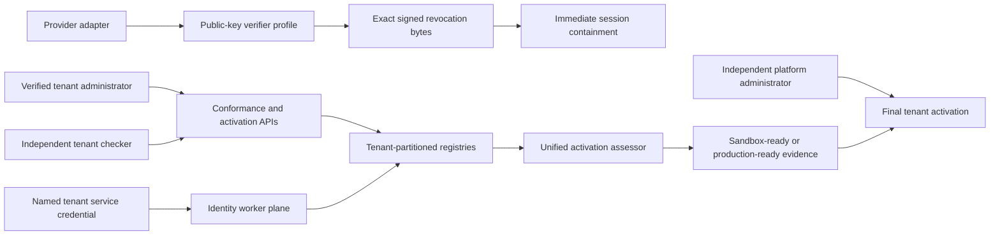

# Tenant activation, persistent conformance and identity runtime

Status: executable greenfield product/control-plane slice, 15 July 2026. No commercial provider is activated. Simulator evidence is permanently non-live and cannot authorize production.

## Outcome

This design joins four controls that previously existed only as separate readiness signals:

1. a single tenant activation decision across admission, staffing, products, integrations, deployment, security, UAT and resilience drills;
2. persistent, expiring conformance administration for organisation-admission and enterprise-platform candidates;
3. a durable tenant-fenced identity-operations worker contract; and
4. cryptographic verification of provider revocation/logout envelopes before immediate session containment.

The platform is greenfield. There is no compatibility route that can activate a tenant from old booleans, accept an unsigned provider callback, treat a simulator result as live, or let a human API caller impersonate a worker.

## Architecture

Tenant-human authority, tenant-service authority and platform activation authority are separate trust boundaries. Effective actors are derived from authenticated sessions or credentials; request bodies cannot choose them.

## Unified tenant activation gate

`packages/core/src/tenant-activation-gate.js` evaluates eight mandatory dimensions:

| Dimension | Minimum evidence |
| --- | --- |
| Organisation admission | approved decision and all required organisation checks complete |
| IAM staffing | at least two active verified humans, launch and feature coverage, no SoD violations or orphaned required roles |
| Products | every selected product has same-tenant current readiness evidence |
| Integrations | every required integration campaign has passed current evidence |
| Deployment | every required component is healthy and rollback is verified |
| Security controls | every required control is effective and fail-closed behavior is verified |
| UAT | passed, adverse cases complete and tenant sign-off complete |
| Drills | every required scenario passed and independent witnessing is complete |

Each evidence object is tenant-bound, dimension-bound, time-bounded and checksum-sealed. Missing, cross-tenant, stale, malformed, mismatched or altered evidence blocks. Requirement and evidence insertion order do not change the assessment checksum.

The result is one of:

- `blocked`: sandbox and production are denied;
- `sandbox_ready`: the full control set passed, but at least one item is simulated/non-live; or
- `production_ready`: every item is current, same-tenant and live.

Simulator evidence can never return `production_ready`. `POST /admin/tenant-activation/assessments` stores the exact assessment input and result with the authenticated tenant assessor. The public-organisation activation path recomputes the newest assessment at activation time, validates its checksum, requires an exact expected checksum and then requires a different authenticated human platform administrator/security administrator with approval and evidence-validation references. Existing provisioning, role-coverage, UAT and handover gates remain conjunctive; the unified assessment does not replace or weaken them.

## Persistent conformance administration

`packages/core/src/conformance-campaign-administration.js` manages two canonical target types:

- `organisation_admission` uses the versioned `INT-ADM-01..10` scenario packs;
- `enterprise_platform` uses the KMS/HSM/vault, broker/DLQ, CDC/checkpoint, MDM, deployment-controller and trusted-time packs.

Candidate profiles identify a tenant, provider/proxy, adapter contract, simulator configuration, due-diligence evidence and an explicit allow-list of canonical targets. Profiles are immutable, checksum-sealed, simulator-only and idempotent. They carry `activationAuthority: none`.

A campaign:

1. is proposed by an authenticated tenant administrator against one profiled target;
2. seals the complete current canonical scenario manifest and candidate-profile checksum;
3. is approved by a different authenticated tenant administrator;
4. accepts append-only, scenario-specific, checksum-sealed evidence with replay-conflict detection;
5. is assessed by a principal independent of every evidence executor, after validating the current profile, manifest, result checksums and replay index; and
6. becomes `simulator_certified` only when every mandatory scenario passes, otherwise `blocked`.

Certification expires after at most 366 days. Expiry never edits historical evidence. Reassessment creates a new campaign linked to the previous one and repeats maker-checker approval. Persistent APIs are under `/admin/conformance`; the dashboard exposes candidate registration, campaign proposal/approval/assessment and current expiry status.

This campaign registry is procurement/UAT evidence, not vendor activation. Commercial activation still requires the selected provider's contract, residency/subprocessor position, credentials, network configuration, proprietary fixture/schema mapping, provider-native adverse UAT, monitoring, reconciliation, rollback and institution sign-off.

## Cryptographic provider revocation boundary

`packages/core/src/federated-revocation-verification.js` replaces caller-asserted `signatureVerified` with actual RS256 or ES256 verification.

A verifier profile contains only public JWKs, their key IDs, algorithm, validity windows and evidence references. It is bound to exactly one tenant, federation policy, protocol, issuer and audience. One human proposes it; another activates it. A policy/protocol can have one active verifier. Rotation must name the active superseded profile, retaining both profile and activation checksum lineage.

`POST /federation/v1/logout-events` requires a tenant service credential scoped to `federation:revoke` (or `*`) and a canonical base64url envelope containing the profile ID, key ID, exact payload bytes and signature. Verification performs, in order:

1. active same-tenant profile validation;
2. profile and activation checksum validation;
3. certified key lookup and validity-window validation;
4. public-key signature verification over the exact supplied bytes;
5. JSON parsing only after signature verification; and
6. exact tenant/policy/protocol/issuer/audience scope matching.

The resulting cryptographic lineage is mandatory input to the revocation state transition. The evidence checksum is the SHA-256 of the exact signed bytes. Only then may matching sessions be revoked. Unknown, expired, tampered, cross-tenant, wrong-audience, wrong-policy or non-canonical envelopes fail closed. The present adapter profile remains `simulated`/`commerciallyLive: false`; production needs provider-native logout signing or an independently governed gateway-attestation design.

## Durable identity operations worker

`packages/core/src/identity-operations-worker.js` and `/identity-operations-worker/v1` provide the persistent execution contract for readiness assessment, directory reconciliation, federation-metadata validation and activity-custody verification.

Human administrators schedule reference-only jobs to an active named service credential. The API derives the workload reference from tenant and credential ID. Worker calls require that same tenant service credential with `identity-operations:work` or `*`; a caller cannot substitute a workload identity in the body.

Claims are tenant/workload filtered, bounded, lease-expiring and monotonically fenced. A reclaimed job receives a higher generation and token, so a resumed old worker cannot commit. Results require evidence and result checksums. Failures use deterministic bounded exponential backoff; exhaustion or a final lease expiry creates an immutable dead letter, alert and critical escalation. Runs cannot finalize while any claim is unresolved and close `failed_closed` when a claim retried, dead-lettered or was displaced.

Dead-letter replay creates a new lineage-linked job. The administration API first records a checksum-sealed replay proposal by one human. A different human approves it with an authority reference. The source job and dead letter remain immutable. Replay does not silently close alerts or escalations.

The current runtime is store-backed and exposes a deployable pull-worker API; it does not itself provide a cloud cron, queue broker or provider SDK. Production deployment must place claim/outcome transactions behind database compare-and-set semantics, use short-lived workload credentials, run one tenant partition at a time, export metrics/alerts, and implement the four handlers through certified provider ports.

## Persistence and audit

The file/PostgreSQL tenant data contract now includes candidate profiles, campaigns, activation assessments, jobs, worker runs, dead letters, replay requests/replays, alerts, escalations and verifier profiles. Every mutation emits the authenticated actor, object ID, disposition and checksum lineage into the tenant audit chain. PostgreSQL deployments must enforce the same tenant partition through RLS and atomic claim/outcome updates.

## Operations and rollback

- A failed activation assessment leaves the tenant quarantined; fix evidence and create a new assessment.
- A stale assessment cannot be reused because activation recomputes it at the current time.
- A failed conformance campaign is retained and superseded by a new campaign; evidence is never rewritten.
- A compromised verifier is superseded through maker-checker rotation, the affected federation policy can be immediately suspended, and sessions can be revoked independently.
- A stuck worker lease is reclaimed under a higher fence; an exhausted job is dead-lettered and visible.
- Replay is a new job, not a reset of the old job.
- Simulator records cannot be promoted in place to live records.

## Executable acceptance evidence

- `tests/tenant-activation-gate.test.js`, `tests/tenant-activation-api.test.js`, `tests/organisation-signup-api.test.js`
- `tests/conformance-campaign-administration.test.js`, `tests/conformance-administration-api.test.js`
- `tests/federated-revocation-verification.test.js`, `tests/federated-revocation-verifier-api.test.js`, `tests/federated-revocation-api.test.js`
- `tests/identity-operations-worker.test.js`, `tests/identity-operations-worker-api.test.js`
- `tests/identity-operational-automation.test.js`, `tests/identity-operations-api.test.js`

## Remaining external work

The product/control-plane work is complete for this bundle. Production remains blocked on selected vendors/direct authorities, contracts and commercial terms, India-residency/subprocessor approval, tenant-specific credentials and keys, network allow-listing, proprietary schemas/native fixtures, deployed schedulers/controllers, managed database CAS/RLS evidence, live telemetry and immutable custody, provider/institution-witnessed adverse UAT and drills, independent security/DR assurance, and staffed on-call operating evidence.
